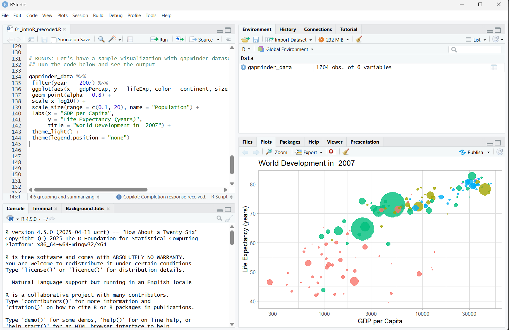
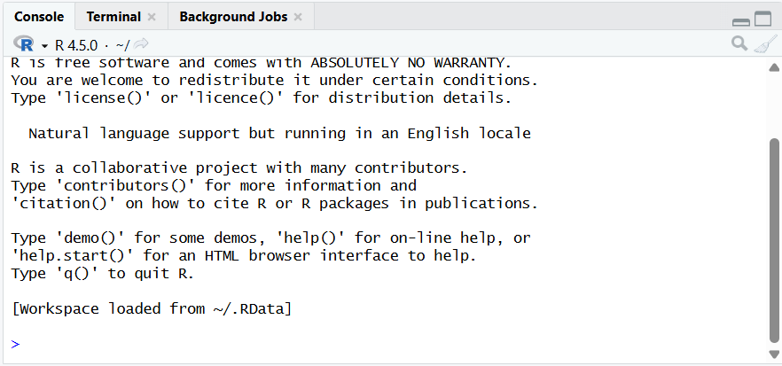
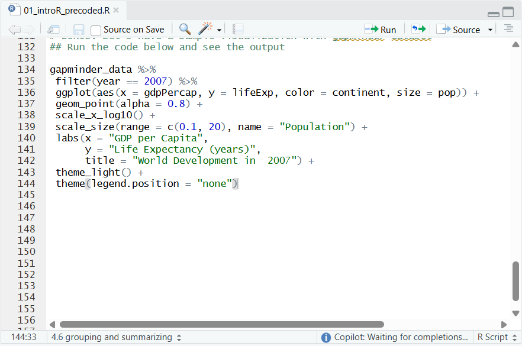
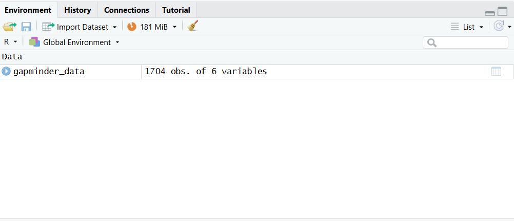
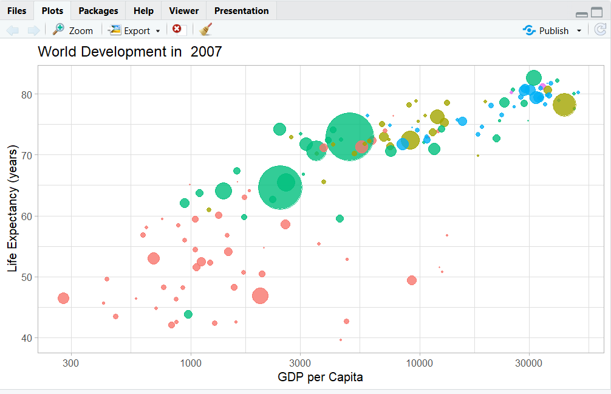

```{r}
#| echo: false
#| include: false

knitr::opts_chunk$set(comment = "", collapse = TRUE)

## working directory

setwd(here::here("module-01-intro-r"))

## libraries
library(tidyverse)

## theme
```

## Overview

::: incremental
-   What is R?
-   Installing R and RStudio
-   R objects
-   Packages and help pages
-   R notation
:::

# 

::: {style="font-size: 80%; text-align: center;"}
{width="90%" fig-align="center"}

Illustration adopted from [Allison Horst](https://twitter.com/allison_horst)
:::

# What is R?

## So ... what is R programming?

-   **R** is a language + an eco-system
    -   a free and open-source programming language
    -   statistical analysis, graphics representation, and reporting
    -   an eco-system of many high-quality user-contributed libraries/packages
    -   freely available under the GNU General Public License, and pre-compiled binary versions are provided for various operating systems (e.g., Linux, Windows, and Mac)

::: incremental
-   Before, R is known for its statistical analysis toolkits
-   Nowadays R is capable of many other tasks
    -   tools that facilitates the whole data analysis workflow
    -   tools for web technology
    -   even this presentation is made in R!
    -   also our class website is entirely built in R!
:::

## The History of R programming

<br>

::: {.box style="padding-bottom:56.25%; position:relative; display:block; width:100%"}
<iframe width="100%" height="100%" src="https://www.youtube.com/embed/iq_biXEIx-U?si=qq-ArfqGkbO9oYGm" frameborder="0" allowfullscreen style="position:absolute; top:0; left: 0">

</iframe>
:::

## Uses of R programming

<br>

{fig-align="center" width="90%" height="90%"}

::: {style="font-size: 0.8em;"}
Source: [DataFlair](https://data-flair.training/blogs/r-applications/)
:::

## Why R for future economists and analysts?

<br>

::: {.callout-tip style="font-size: 2.5em;"}
## Reading assingment

[Why should economist use R? A peek at my journey!](https://www.hanomics.com/post/why-should-economists-use-r-a-peek-at-my-journey) by Hany Abdel-Latif
:::

> *"R is a powerful, flexible, and free software environment that allows economists to analyze data, estimate models, and visualize results in a reproducible way."*

# Installing R and RStudio

## Installing R and RStudio on Windows

<br>

::: {.box style="padding-bottom:56.25%; position:relative; display:block; width:100%"}
<iframe width="100%" height="100%" src="https://www.youtube.com/embed/mxNrU902uyc?si=4ZpkkJWR0U4t9DRV" frameborder="0" allowfullscreen style="position:absolute; top:0; left: 0">

</iframe>
:::

## Installing R and RStudio on Mac/MacOS

<br>

::: {.box style="padding-bottom:56.25%; position:relative; display:block; width:100%"}
<iframe width="100%" height="100%" src="https://www.youtube.com/embed/I5WIMX4LK8M?si=KTR7GarK-JAB6Kej" frameborder="0" allowfullscreen style="position:absolute; top:0; left: 0">

</iframe>
:::

## RStudio interface

{height="90%" width="90%" fig-align="center"}

## RStudio interface: `Console window`

-   located in the bottom-left
-   where you often will find the output of your coding and computations

{fig-align="center"}

## RStudio interface: `Source window`

-   located in the top-left
-   *source* can be understood as any type of file, e.g. data, programming code, notes, etc.
-   edit script, text, markdown, website, others

{width="70%" height="70%" fig-align="center"}

## RStudio interface: `Environment/ History/ Connections/ Tutorials`

-   located in the top-right
-   **Environment:** shows saved R objects
-   **History:** computation you run in the console will be stored
-   **Connections:** allows the user to tab into external databases directly
-   **Tutorials:** additional materials to learn R and RStudio

{width="80%" height="80%" fig-align="center"}

## RStudio interface: `Files/ Plots/ Packages/ Help/ Viewer`

-   located in the bottom-right

{width="80%" height="80%" fig-align="center"}

# R objects and packages

## R Objects

::::: columns
::: {.column width="60%"}
-   You can consider R objects as **saving information**

-   e.g., text, number, matrix, vector, dataframe

-   In another words everything in R is an object
:::

::: {.column width="40%"}
{width="60%" fig-align="center"}
:::
:::::

## R objects

-   Objects in R are assigned a value using ←

:::::::::: columns
:::::: column
::: fragment
```{r}
#| echo: true
#| eval: false

a1 <- 10
a1
```

```{r}
a1 <- 10
a1
```
:::

<br>

::: fragment
```{r}
#| echo: true
#| eval: false

a2 <- 20
a2
```

```{r}
a2 <- 20
a2
```
:::

<br>

::: fragment
```{r}
#| echo: true
#| eval: false

a3 <- c(10, 20, 30)
a3
```

```{r}
a3 <- c(10, 20, 30)
a3
```
:::
::::::

::::: column
::: fragment
```{r}
#| echo: true
#| eval: false

a1 + a2
```

```{r}
a1 + a2
```
:::

<br>

::: fragment
```{r}
#| echo: true
#| eval: false

st_name <- "christopher"
st_age <- 23
st_sex <- "male"
student <- c(st_name, st_age, st_sex)

student
```

```{r}
st_name <- "christopher"
st_age <- 23
st_sex <- "male"
student <- c(st_name, st_age, st_sex)

student
```
:::
:::::
::::::::::

## R packages

::::: columns
::: column
-   Collection of functions that load into your working environment.

-   A package contains code that other R users have prepared for the community.

-   Installing a package

```{r}
#| eval: false
#| echo: true

install.packages("tidyverse")
```

-   Loading a package

```{r}
#| eval: false
#| echo: true

library(tidyverse)
```
:::

::: column
{width="80%" fig-align="center"}
:::
:::::

# Functions

## R functions

-   R comes with built-in functions
-   For example, you can round a number with `round` function

::::: columns
::: column
```{r}
#| echo: fenced
round(3.1415)
```

```{r}
#| echo: fenced

factorial(3)
```
:::

::: column
:::
:::::

## Arguments

-   data that you pass into the function is called the function’s argument
-   Linking functions together, R resolves them from innermost operation to the outermost

``` r
die <- 1:6

mean(1:6)
## 3.5

mean(die)
## 3.5

round(mean(die))
## 4
```

{fig-align="center" width="120%" height="120%"}

## Arguments

-   use `args` functions if you are not sure with the argument's name in a function
-   some `arguments` are optional
    -   they come with a default value
    -   e.g., `digits` is already set to `0`

```{r}
#| echo: fenced

args(round)
```

## Sample with replacements

-   `sample(x, size, replace = FALSE, prob = NULL)`
-   `sample` will return `size` elements from the vector
-   `sample` takes two **arguments**: a vector named `x` and a number named `size`

```{r}
#| echo: fenced
sample(x = 1:4, size = 2)
```


## Sample with replacements

- by default `sample` builds a sample *without replacement*
- `replace = TRUE` causes sample to *sample with replacement*

```{r}
#| echo: fenced
die <- 1:6

sample(x = die, size = 2, replace = TRUE)
```


## Function constructor

- functions in R has three basic parts: name, body of code, and set of arguments

```{r}
#| echo: fenced
my_function <- function() {}
```


## Function constructor

- `function` will build a function between braces

```{r}
#| echo: fenced
roll <- function() {
  die <- 1:6
  dice <- sample(die, size = 2, replace = TRUE)
  sum(dice)
}
```


## Function constructor 


# R notation

## Selecting values 

- R has notation for selecting values from R objects
- `data[row, column]`

```{r}
#| echo: fenced
gapminder_dta <- gapminder::gapminder

gapminder_dta[1, ]
```


## Selecting values

- R has notation for selecting values from R objects
- `data[row, column]`

```{r}
#| echo: fenced
gapminder_dta[, 2]
```


## Selecting values

- R has notation for selecting values from R objects
- `data[row, column]`

```{r}
#| echo: fenced

gapminder_dta[3, 2]
```


# 

{fig-align="center" height="40%" width="40%"}