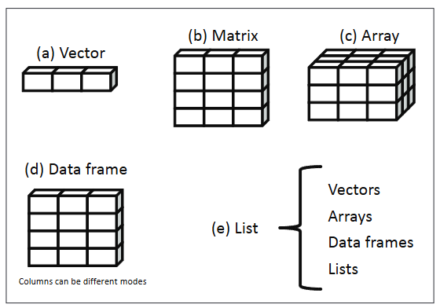
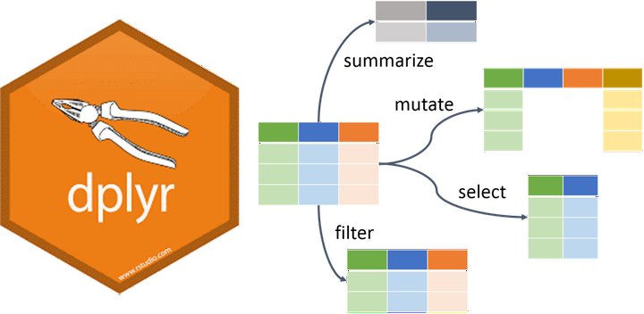
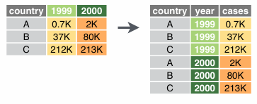
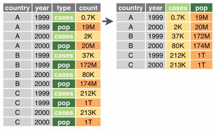

```{r}
#| echo: false
#| include: false

knitr::opts_chunk$set(comment = "", collapse = TRUE, echo = TRUE)

## working directory
setwd(here::here("module-2-data-management/"))

## libraries
library(tidyverse)
library(readxl)
```

## Overview

::: incremental
- Dataframe and tibble
- Introduction to Tidyverse
- Basic data wrangling with `dplyr`
- Data reshaping
- Case studies
:::

# 

::: {style="font-size: 80%; text-align: center;"}
{width="90%" fig-align="center"}

Illustration adopted from [Allison Horst](https://twitter.com/allison_horst)
:::

# Introduction to Tidyverse

## Tidyverse package {.center-text}

{height="60%" width="50%" fig-align="center"}

## What is tidyverse?

A collection of R packages designed for data science.

All packages share an underlying philosophy, grammar, and data structure.

<center></center>

## 

<center></center>

::: {style="font-size:70%; text-align:center;"}
Illustration adopted from [Allison Horst](https://github.com/allisonhorst)
:::

## 

<center></center>

::: {style="font-size:70%; text-align:center;"}
Illustration adopted from [Allison Horst](https://github.com/allisonhorst)
:::

## 

::: center-text
**Tidy data makes it easier for reproducibility and reuse**
:::

<center></center>

::: {style="font-size:70%; text-align:center;"}
Illustration adopted from [Allison Horst](https://github.com/allisonhorst)
:::

## 

::: center-text
**Yehey! Tidy Data for the win!**
:::

<center></center>

::: {style="font-size:70%; text-align:center;"}
Illustration adopted from [Allison Horst](https://github.com/allisonhorst)
:::

# Data structures

## Data structure

- R has a variety of holding data
- e.g., scalars, vectors, matrices, arrays, dataframes

{fig-align="center"}

## Vectors

- vectors are one dimnensional arrays that can hold numeric, character, or logical data
- combine function `c()` is used to form a vector

```{r}
#| echo: fenced

a <- c(1, 2, 5, 3, 6, -2, 4)
b <- c("one", "two", "three")
c <- c(TRUE, TRUE, TRUE, FALSE, TRUE, FALSE)
```

::: incremental
- `a` is a numeric vector
- `b` is a character vector
- `c` is a logical vector
:::

## Vectors

- vectors are one dimnensional arrays that can hold numeric, character, or logical data
- combine function `c()` is used to form a vector
- scalars are one-element vectors. They’re used to hold constants.
  - e.g., `f <- 3`, g `<- "US"` and `h <- TRUE`

```{r}
#| echo: fenced

a <- c(1, 2, 5, 3, 6, -2, 4)
b <- c("one", "two", "three")
c <- c(TRUE, TRUE, TRUE, FALSE, TRUE, FALSE)
```

## Vectors

::: {.callout-note style="font-size:1.5em;"}
## Remember

Data in a vector must only be one type or mode (numeric, character, or logical). You can’t mix modes in the same vector. If you try to mix data types (modes) in a vector, R automatically converts the elements of the vector to a single, common type.
:::

- logicals and numerics, logicals → numeric (`TRUE = 1`,`FALSE = 0`)

- integers and numerics, integers → numeric

- anything with characters → character strings

```{r}
#| echo: fenced
my_vector <- c(1, "hello", TRUE, 3.14)
my_vector

# Check the type of the vector
typeof(my_vector)
```

## Matrices

- two-dimensional array where each element has the same data types
- matrices are created with the `matrix` function

```{r}
#| echo: fenced

y <- matrix(1:20, nrow = 5, ncol = 4)
y
```

## Matrices

- two-dimensional array where each element has the same data types
- matrices are created with the `matrix` function

```{r}
#| echo: fenced
# elements, row and column names
cells <- c(1, 26, 24, 68)
rnames <- c("R1", "R2")
cnames <- c("C1", "C2")

# my matrix
mymatrix <- matrix(
  cells,
  nrow = 2,
  ncol = 2,
  byrow = TRUE,
  dimnames = list(rnames, cnames)
)

# print matrix
mymatrix
```

## Data frame

- a more general than a matrix in that different columns can contain different modes of data

- similar to the datasets you’d typically see in SAS, SPSS, and Stata

- data frames are the most common data structure you’ll deal with in R


## Data frame

- data frames are the most common data structure you will be working in R
- you can create a data frame using `data.frame()` function

```{r}
#| echo: fenced
## creating column vector
patientID <- c(1, 2, 3, 4)
age <- c(25, 34, 28, 52)
diabetes <- c("Type1", "Type2", "Type1", "Type1")
status <- c("Poor", "Improved", "Excellent", "Poor")

## using data.frame to create patient_data frame
patientdata <- data.frame(patientID, age, diabetes, status)

## print patient data frame
patientdata
```

## Tibble

- a modern reimagining of `data.frame`
- tibbles are data frames
- create a tibble from individual vectors using `tibble()` function

```{r}
#| echo: fenced

tibble(
  x = 1:5,
  y = 1,
  z = x^2 + y
)
```

## Tibble

- we can coerce a data frame to a tibble using `as_tibble` function

::::: columns
::: column
```{r}
#| echo: fenced
iris
```
:::

::: column
```{r}
#| echo: fenced
as_tibble(iris)
```
:::
:::::

# check-up quiz

## Which of the following is NOT a basic data structure in R? {.quiz-question}

- Vector
- Matrix
- Array
- [Function]{.correct data-explanation="Correct! R’s basic data structures include scalars, vectors, matrices, arrays, data frames, and lists. Functions are not considered data structures; they are tools for computation."}

## What is the correct description of a vector in R? {.quiz-question}

- A two‑dimensional array with elements of the same type
- [A one‑dimensional array that can hold numeric, character, or logical data]{.correct data-explanation="Correct! Vectors are the simplest data structure in R. They are one‑dimensional and must contain elements of the same type (numeric, character, or logical)"}
- A collection of variables of different modes stored in columns
- A hierarchical structure for storing lists

## What happens if you mix data types in a vector? {.quiz-question}

- R throws an error and stops execution
- [R automatically converts all elements to a single common type]{.correct data-explanation="Correct! R enforces homogeneity in vectors. If you mix types, R coerces them into a common type (e.g., numbers + characters → character)."}
- R stores each element in its original type
- R creates a list instead of a vector

## Which function is used to create a matrix in R? {.quiz-question}

- c()\
- data.frame()\
- [matrix()]{.correct data-explanation="Correct! The matrix() function creates two‑dimensional arrays where all elements are of the same type.Unlike matrices, which require all elements to be of the same type, data frames allow each column to store different types (numeric, character, logical). This makes them more flexible and widely used in R."}\
- array()

## How does a data frame differ from a matrix in R? {.quiz-question}

- A data frame can only hold numeric data
- [A data frame allows different columns to contain different modes of data]{.correct data-explanation="Correct! Unlike matrices, which require all elements to be of the same type, data frames allow each column to store different types (numeric, character, logical). This makes them more flexible and widely used in R."}
- A data frame is limited to two dimensions
- A data frame cannot be printed in tabular form

# Reading data into R

## Importing data

- SPSS, Stata, SAS files: [haven package](https://haven.tidyverse.org/)

- Excel files: [readxl package](https://readxl.tidyverse.org/)

- CSV files: [readr package](https://readr.tidyverse.org/)

## Importing data into R

#### SPSS, Stata & SAS using [haven package](https://haven.tidyverse.org/)

::::: columns
::: column
```{r}
#| echo: true
#| eval: false

# loading haven package
library(haven)
```

<br>

```{r}
#| echo: true
#| eval: false

# SPSS
read_sav("path/data.sav")
```

<br>

```{r}
#| echo: true
#| eval: false

# Stata
read_dta("path/data.dta")
```

<br>

```{r}
#| echo: true
#| eval: false

# SAS
read_sas("path/data.sas7bdat")
```
:::

::: column
```{r}
#| echo: false
#| fig-align: center
#| out-width: "40%"


```
:::
:::::

## Importing data into R

#### Excel files using [readxl package](https://readxl.tidyverse.org/)

<br>

::::: columns
::: {.column width="70%"}
```{r}
#| echo: true
#| eval: false
library(readxl)
read_excel("path/dataset.xls")
```

```{r echo=FALSE}
#| echo: false
#| results: hold 

dataset_xl_sample <- readxl::readxl_example("datasets.xlsx")
readxl::read_excel(dataset_xl_sample)
```
:::

::: {.column width="30%"}
```{r}
#| echo: false
#| fig-align: center
#| out-width: "40%"


```
:::
:::::

## Importing data into R

#### CSV files using [readr package](https://readr.tidyverse.org/)

<br>

::::: columns
::: {.column width="60%"}
```{r}
#| echo: true
#| eval: false

install.packages("readr")
library(readr)
```

<br>

```{r}
#| echo: true
#| eval: false

# comma separated (CSV) files
read_csv("path/data.csv")
```

<br>

```{r eval=FALSE}
#| echo: true
#| eval: false

# tab separated files
read_tsv("path/data.tsv")
```

<br>

```{r eval=FALSE}
#| echo: true
#| eval: false

# general delimited files
read_delim("path/data.delim")
```
:::

::: {.column width="40%"}
```{r}
#| echo: false
#| fig-align: center
#| out-width: "40%"

knitr::include_graphics("img/readr.png")
```
:::
:::::

# Check-up quiz

## Which R package is used to import SPSS, Stata, and SAS files? {.quiz-question}

- readr\
- [haven]{.correct data-explanation="Correct! The haven package is designed to import data from SPSS (.sav), Stata (.dta), and SAS (.sas7bdat) files."}\
- readxl\
- tidyr

## If you want to import Excel files into R, which function should you use? {.quiz-question}

- read_csv()\
- [read_excel()]{.correct data-explanation="Correct! The readxl package provides the read_excel() function to import .xls or .xlsx files."}\
- read_sav()\
- read_tsv()

## Which function from the readr package is used to import comma‑separated values (CSV) files? {.quiz-question}

- [read_csv()]{.correct data-explanation="Correct! The readr package includes read_csv() for CSV files, read_tsv() for tab‑separated files, and read_delim() for general delimited files."}\
- read_delim()\
- read_tsv()\
- read_excel()

## Which of the following statements about importing data into R is TRUE? {.quiz-question}

- read_sav() is used for Excel files
- [read_tsv() is used for tab‑separated files]{.correct data-explanation="Correct! The readr package provides read_tsv() specifically for tab‑separated files."}
- read_excel() is part of the readr package
- read_dta() is used for CSV files

## Which package would you use if you need to import a dataset saved in Stata format (.dta)? {.quiz-question}

- readxl\
- readr\
- [haven]{.correct data-explanation="Correct! The haven package supports importing Stata files using the read_dta() function."}\
- tidyr

# Basic data wrangling with `dplyr`

## Data wrangling using `dplyr` {.center-text}

<center></center>

::: {style="font-size:70%; text-align:center;"}
Illustration adopted from [Allison Horst](https://github.com/allisonhorst)
:::

## `dplyr`

:::::: columns
:::: column
**Overview**

- `select()` picks variables based on their names

- `mutate()` adds new variables

- `filter()` picks cases based on their values

- `summarise()` reduces multiple values down to a single summary

- `arrange()` change the ordering of the rows

::: aside
see `dplyr` [cheatsheets](https://github.com/rstudio/cheatsheets/blob/cd775237fd6de08df51e69941fe01967ecd9bdc2/data-transformation.pdf)
:::
::::

::: column
{fig-align="center"}
:::
::::::

## `select()`

::::: columns
::: {.column width="50%"}
```{r}
#| echo: false
data <- gapminder::gapminder
```

```{{r}}
data
```

<br>

```{r}
#| class-output: "remark-code"
#| echo: true

data
```
:::

::: {.column width="50%"}
```{{r}}
select(data, continent, country, pop)
```

<br>

```{r}
#| echo: true
#| class-output: "remark-code"
select(data, continent, country, pop)
```
:::
:::::

## `select()`

We can also **remove** variables with a **`-`** (minus)

::::: columns
::: column
```{r echo=FALSE}
data <- gapminder::gapminder
```

```{{r}}
data
```

<br>

```{r}
#| echo: true
#| class-output: "remark-code"

data
```
:::

::: column
```{{r}}
select(data, -year, -pop)
```

<br>

```{r}
#| echo: true
#| class-output: "remark-code"

select(data, -year, -pop)
```
:::
:::::

## `select()`

**Selection helpers**

These *selection helpers* match variables according to a given pattern.

- `starts_with()` starts with a prefix

- `ends_with()` ends with a suffix

- `contains()` contains a literal string

- `matches()` matches regular expression

## `filter()`

::::: columns
::: {.column width="50%"}
```{{r}}
data
```

<br>

```{r}
#| echo: true
#| class-output: "remark-code"

data
```
:::

::: {.column width="50%"}
```{{r}}
filter(data, country == "Philippines")
```

<br>

```{r}
#| echo: true
#| class-output: "remark-code"

filter(data, country == "Philippines")
```
:::
:::::

## `mutate()`

The `mutate` function will take a statement similar to this:

- `variable_name` = `do_some_calculation`

- `variable_name` will be attached at the end of the dataset.

## `mutate()`

Let's calculate the `gdp`

::::: columns
::: column
```{{r}}
data
```

<br>

```{r}
#| echo: true
#| class-output: "remark-code"

data
```
:::

::: column
```{{r}}
mutate(data, GDP = gdpPercap * pop)
```

<br>

```{r}
#| echo: true
#| class-output: "remark-code"

mutate(data, GDP = gdpPercap * pop)
```
:::
:::::

## `rename()`

Changes the variable name while keeping all else intact.

- `new_variable_name` = `old_variable_name`

::::: columns
::: column
```{{r}}
data
```

<br>

```{r}
#| echo: true
#| class-output: "remark-code"

data
```
:::

::: column
```{{r}}
rename(data, population = pop)
```

<br>

```{r}
#| echo: true
#| class-output: "remark-code"
rename(data, population = pop)
```
:::
:::::

## `arrange()`

You can order data by variable to show the highest or lowest values first.

::::: columns
::: column
consider `lifeExp` default is lowest first

```{{r}}
data
```

<br>

```{r}
#| echo: true
#| class-output: "remark-code"
data
```
:::

::: column
`desc()` sort `lifeExp` from highest to lowest

```{{r}}
arrange(data, desc(lifeExp))
```

<br>

```{r}
#| echo: true
#| class-output: "remark-code"

arrange(data, desc(lifeExp))
```
:::
:::::

## `group_by` and `summarise()`

- Use when you want to aggregate your data (by groups).

- Sometimes we want to calculate group statistics.

<br>

::: {style="fig.align="center";"}

:::

## `group_by` and `summarise()`

Suppose we want to know the average population by continent.

::::: columns
::: column
```{{r}}
data
```

<br>

```{r}
#| echo: true
#| class-output: "remark-code"

data
```
:::

::: column
```{{r}}
grouped_by_continent <- group_by(data, continent)
summarise(grouped_by_continent, avg_pop = mean(pop))
```

<br>

```{r}
#| echo: true
#| class-output: "remark-code"

grouped_by_continent <- group_by(data, continent)
summarise(grouped_by_continent, avg_pop = mean(pop))
```
:::
:::::

## `group_by` and `summarise()`

Suppose we want to know the average population by continent.

::::: columns
::: column
```{{r}}
data
```

<br>

```{r}
#| echo: true
#| class-output: "remark-code"

data
```
:::

::: column
```{{r}}
grouped_by_continent <- group_by(data, continent)
summarised_data <- summarise(grouped_by_continent, avg_pop = mean(pop))
arrange(summarised_data, desc(avg_pop))
```

<br>

```{r}
#| echo: true
#| class-output: "remark-code"

grouped_by_continent <- group_by(data, continent)
summarised_data <- summarise(grouped_by_continent, avg_pop = mean(pop))
arrange(summarised_data, desc(avg_pop))
```
:::
:::::

##  {transition="fade" auto-animate="true"}

::::: columns
::: column
### Too many codes!

### It's hard to follow!

### It's hard to keep track of the codes!
:::

::: column

:::
:::::

##  {transition="fade" auto-animate="true"}

<center></center>

### `%>%` or `|>`pipe operator {.center-text}

## The `%>%` and `|>` operator

The **`%>%`** or **`|>`** helps your write code in a way that is easier to read and understand.

::::: columns
::: column
```{{r}}
grouped_by_continent <- group_by(data, continent)
summarised_data <- summarise(grouped_by_continent, avg_pop = mean(pop))
arrange(summarised_data, desc(avg_pop))
```

<br>

```{r}
#| echo: true
#| class-output: "remark-code"

grouped_by_continent <- group_by(data, continent)
summarised_data <- summarise(grouped_by_continent, avg_pop = mean(pop))
arrange(summarised_data, desc(avg_pop))
```
:::

::: column
```{{r}}
data %>% 
  group_by(continent) %>% 
  summarise(avg_pop = mean(pop)) %>% 
  arrange(desc(avg_pop))
```

<br>

```{r}
#| echo: true
#| class-output: "remark-code"

data %>%
  group_by(continent) %>%
  summarise(avg_pop = mean(pop)) %>%
  arrange(desc(avg_pop))
```
:::
:::::

## The`%>%`operator

What is the average life expectancy of Asian countries per year?

::::: columns
::: column
```{{r}}
filtered_by_asia <- filter(data, continent == "Asia")
grouped_by_country_year <- group_by(filtered_by_asia, country, year)
summarise(grouped_by_country_year, avg_lifeExp = mean(lifeExp))
```

<br>

```{r}
#| echo: true
#| class-output: "remark-code"

filtered_by_asia <- filter(data, continent == "Asia")
grouped_by_country_year <- group_by(filtered_by_asia, country, year)
summarise(grouped_by_country_year, avg_lifeExp = mean(lifeExp))
```
:::

::: column
```{{r}}
data %>% 
  filter(continent == "Asia") %>% 
  group_by(country, year) %>% 
  summarise(avg_lifeExp = mean(lifeExp))
```

<br>

```{r}
#| echo: true
#| class-output: "remark-code"

data %>%
  filter(continent == "Asia") %>%
  group_by(country, year) %>%
  summarise(avg_lifeExp = mean(lifeExp))
```
:::
:::::

## The `%>%` operator

<br>

::::: columns
::: column
```{{r}}
filtered_by_asia <- filter(data, continent == "Asia")
grouped_by_country <- group_by(filtered_by_asia, country)
summarised_by_country <- summarise(grouped_by_country, avg_lifeExp = mean(lifeExp))
arrange(summarised_by_country, desc(avg_lifeExp))
```

<br>

```{r}
#| echo: true
#| class-output: "remark-code"

filtered_by_asia <- filter(data, continent == "Asia")
grouped_by_country <- group_by(filtered_by_asia, country)
summarised_by_country <- summarise(
  grouped_by_country,
  avg_lifeExp = mean(lifeExp)
)
arrange(summarised_by_country, desc(avg_lifeExp))
```
:::

::: column
```{{r}}
data %>% 
  filter(continent == "Asia") %>% 
  group_by(country) %>% 
  summarise(avg_lifeExp = mean(lifeExp)) %>% 
  arrange(desc(avg_lifeExp))
```

<br>

```{r}
#| echo: true
#| class-output: "remark-code"
data %>%
  filter(continent == "Asia") %>%
  group_by(country) %>%
  summarise(avg_lifeExp = mean(lifeExp)) %>%
  arrange(desc(avg_lifeExp))
```
:::
:::::

# Check-up quiz

## Which dplyr function is used to select specific columns from a dataset? {.quiz-question}

- filter()\
- mutate()\
- [select()]{.correct data-explanation="Correct! The select() function picks variables (columns) based on their names."}\
- summarise()

## Which dplyr function is used to add new variables to a dataset? {.quiz-question}

- arrange()\
- [mutate()]{.correct data-explanation="Correct! The mutate() function creates new variables by applying calculations or transformations, attaching them at the end of the dataset."}\
- summarise()\
- filter()

## If you want to keep only rows where country == "Philippines", which function should you use? {.quiz-question}

- select()\
- [filter()]{.correct data-explanation="Correct! The filter() function selects cases (rows) based on their values, such as keeping only rows where country == \"Philippines\"."}\
- arrange()\
- mutate()

## Which dplyr function reduces multiple values down to a single summary statistic (e.g., mean, sum)? {.quiz-question}

- mutate()\
- [summarise()]{.correct data-explanation="Correct! The summarise() function collapses multiple values into a single summary, such as calculating averages or totals."}\
- arrange()\
- select()

## Which dplyr function is used to reorder rows in a dataset? {.quiz-question}

- [arrange()]{.correct data-explanation="Correct! The arrange() function changes the ordering of rows based on specified variables."}\
- mutate()\
- filter()\
- select()

# Basic data transformation

## Reshaping data

- the process of changing the structure or layout of a dataset without altering its actual content.

- it helps organize data into formats that are easier to analyze, visualize, or model.

- same information, different arrangement.

<br>

::::: columns
::: column
**wide formt → long format** 
:::

::: column
**long format → wide format** 
:::
:::::

<!-- end columns -->

## Reshaping data

- `tidyr` package provides powerful functions for reshaping:
  - `pivot_longer()` → converts wide data into long format.
  - `pivot_wider()` → converts long data into wide format.

<br>

::::: columns
::: column
**wide formt → long format** 
:::

::: column
**long format → wide format** 
:::
:::::

<!-- end columns -->

## Wide data format

- each subject or observation occupies a single row, with multiple variables spread across columns.

- one row per entity, many columns for repeated measures.

- easier for human readability and simple summaries. Often used in spreadsheets.

```{r}
#| echo: fenced
read_excel("data/urbanpop.xlsx")
```

## Long data format

- each measurement or observation is stored in its own row, with variables indicating who, what, and when.

- multiple rows per entity, fewer columns.

- referred for statistical modeling, visualization (e.g., `ggplot2` in R), and tidy data principles.

```{r}
#| echo: fenced
read_excel("data/urbanpop.xlsx") |>
  pivot_longer(cols = `1960`:`1966`, names_to = "year", values_to = "urban_pop")
```

## Wide → Long data format

- `pivot_longer()` function "lengthens" data by collapsing several coumns into two
- original column names → names
- data values → value

```{r}
#| echo: fenced
#| eval: false

pivot_longer(data, cols, names_to = "name", values_to = "value")
```


## Wide → Long data format

- `pivot_longer()` function "lengthens" data by collapsing several coumns into two
- original column names → names
- data values → value

::::: columns
::: column
```{r}
#| echo: true
#| class-output: "remark-code"
read_excel("data/urbanpop.xlsx")
```
:::

::: column
```{r}
#| echo: true
#| class-output: "remark-code"
read_excel("data/urbanpop.xlsx") |>
  pivot_longer(cols = `1960`:`1966`, names_to = "year", values_to = "urban_pop")
```
:::
:::::

<!-- end columns -->

## Long → Wide data format

- inverse of `pivot_longer()`, widening data by expanding two columns into many

- used when a dataset is "too long" - an observation is scattered across multiple rows

```{r}
#| echo: fenced
#| eval: false
pivot_wider(data, names_from = "name", values_to = "cases")
```


## Long → Wide data format

- inverse of `pivot_longer()`, widening data by expanding two columns into many

- used when a dataset is "too long" - an observation is scattered across multiple rows

```{r}
#| echo: false
urban_pop_long <-
  read_excel("data/urbanpop.xlsx") |>
  pivot_longer(cols = `1960`:`1966`, names_to = "year", values_to = "urban_pop")
```

::::: columns
::: column
```{r}
#| echo: true
#| class-output: "remark-code"

urban_pop_long
```
:::

::: column
```{r}
#| echo: true
#| class-output: "remark-code"
urban_pop_long |>
  pivot_wider(names_from = year, values_from = urban_pop)
```
:::
:::::

<!-- end columns -->

# 

{fig-align="center" height="40%" width="40%"}