layout: true

```{r meta, echo=FALSE}
# libraries
pacman::p_load(knitr, tidyverse, metathis)
theme_set(theme_minimal())

#change directory

xaringanExtra::use_share_again()
xaringanExtra::style_share_again(share_buttons = c("twitter", "facebook", "linkedin"))

meta() %>% 
  meta_name("github-repo" = "chris-allones/training-data-viz") %>% 
  meta_social(
    title = "Data viz with ggplot2",
    description = "Training Workshop on Data Visualization using ggplot2 in R.",
    url = "https://chris-allones.github.io/data-viz-ggplot2/index.html",
    image = "https://chris-allones.github.io/data-viz-ggplot2/images/preview.png",
    og_type = "website",
    og_author = "Christopher Llones",
    twitter_card_type = "summary_large_image",
    twitter_creator = "@Topenomics",
    twitter_site = "@Topenomics"
  )

```

```{r setup, echo=FALSE}

options(htmltools.dir.version = FALSE,
        knitr.table.format = "html")

knitr::opts_chunk$set(
  fig.width=9, fig.height=3.5, fig.retina=3,
  out.width = "100%",
  cache = FALSE,
  echo = TRUE,
  message = FALSE, 
  warning = FALSE,
  hiline = TRUE,
  comment = "",
  fig.retina = 3,
  fig.align = "center"
)

```

```{r xaringan-themer, echo=FALSE, warning=FALSE}
library(xaringanthemer)

xaringanExtra::use_tile_view()
xaringanExtra::use_extra_styles(hover_code_line = TRUE,
                                mute_unhighlighted_code = FALSE)

xaringanExtra::use_animate_css()
xaringanExtra::use_animate_all("fade")

style_duo_accent(
  primary_color = "#073b4c",
  secondary_color = "#2a9d8f",
  inverse_background_color = "#073b4c",
  inverse_header_color = "#fff",
  # title_slide_background_color = "#073b4c",
  title_slide_background_image = "image/background.jpg",
  title_slide_text_color = "#212529",
  text_font_size = "1.1rem"
)


```

---

## Outline

+ The grammar of graphics

+ Datasets and mapping

+ Geometries

+ Statistical transformation and plotting distribution

+ Position adjustment and scales

+ Coordinates and themes

+ Facets and custom plots

---

class: middle center

# The grammar of graphics
----


---

## Why ggplot2?

.leftcol[

+ Most requested programming languages for data scientists are R and Python.

+ ggplot2 as a visualization package for R, is becoming an industry standard for visualization.

]


.rightcol[
```{r echo=FALSE, out.width="40%", fig.align='center'}
knitr::include_graphics("image/ggplot2_logo.png")
```
]


---

## Why ggplot2?

.leftcol[

+ Relies on an underlying grammar, called layered grammar of graphics

+ Grammars on statistical graphics:

  + Bertin, 1983
  
  + Wilkinson, 2005
  
  + Wickham, 2010

]


.rightcol[
```{r echo=FALSE, out.width="40%", fig.align='center'}
knitr::include_graphics("image/gg_book_cover.jfif")
```

.center[Source: [The grammar of graphics](https://link.springer.com/book/10.1007/0-387-28695-0)]
]


---

## Why a grammar?

.leftcol[

+ You can create new sentences if you know about the grammar.

+ In ggplot2 context, you can create new graphics or tailored plot that suits your needs or preferences.

]


.rightcol[
```{r echo=FALSE, out.width="40%", fig.align='center'}
knitr::include_graphics("image/gg_book_cover.jfif")
```

.center[Source: [The grammar of graphics](https://link.springer.com/book/10.1007/0-387-28695-0)]
]


---

## The idea of grammar of graphics

.left[
<br>
```{r echo=FALSE, out.width="50%"}
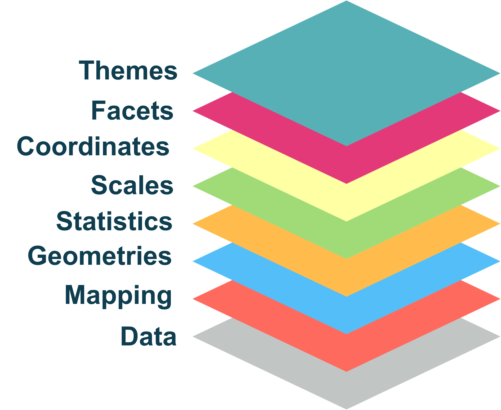
```

]


---

## The idea of grammar of graphics

.leftcol[
```{r include=FALSE}
data1 <- sample_n(diamonds, 15000)
```

```{r echo=FALSE, fig.height=7}
ggplot(data = data1) +
  theme_gray()
```
]

.rightcol[
```{r echo=FALSE, out.width="50%", fig.align='center'}
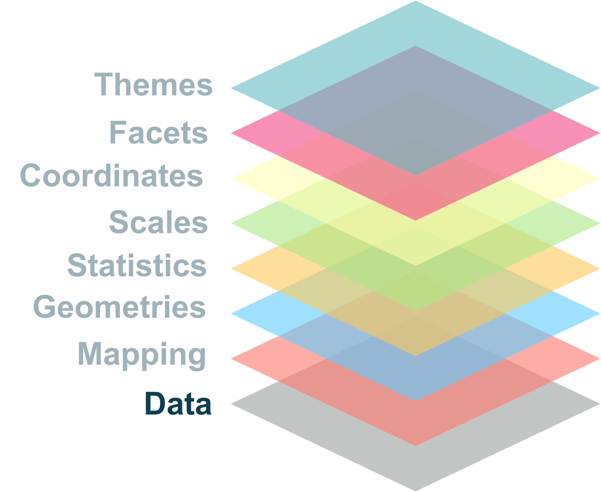
```

```{r fig.height=7, eval=FALSE}
ggplot(data = data1)
```
]

---

## The idea of grammar of graphics

.leftcol[
```{r fig.height=7, echo=FALSE}
ggplot(data = data1, 
       mapping = aes(x = price, y = carat, color = clarity)) #<<
```
]

.rightcol[
```{r echo=FALSE, out.width="50%", fig.align='center'}
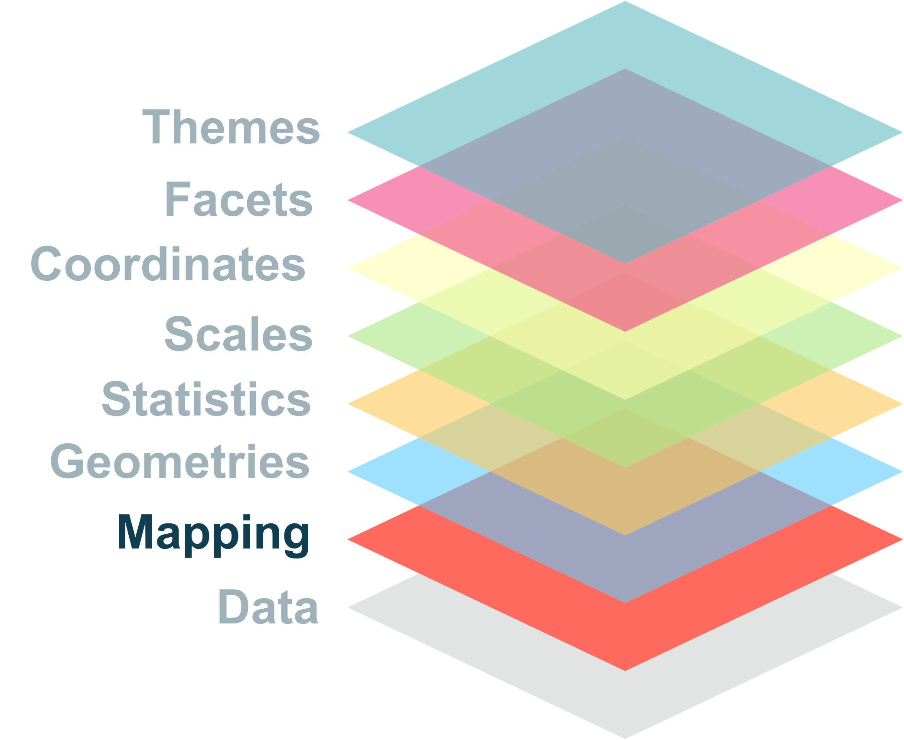
```

```{r fig.height=7, eval=FALSE}
ggplot(data = data1, 
       mapping = aes(x = price, y = carat, color = clarity)) #<<
```
]


---

## The idea of grammar of graphics


.leftcol[
```{r fig.height=7, echo=FALSE}
ggplot(data = data1, 
       mapping = aes(x = price, y = carat, color = clarity)) +
  geom_point()
```
]

.rightcol[
```{r echo=FALSE, out.width="50%", fig.align='center'}
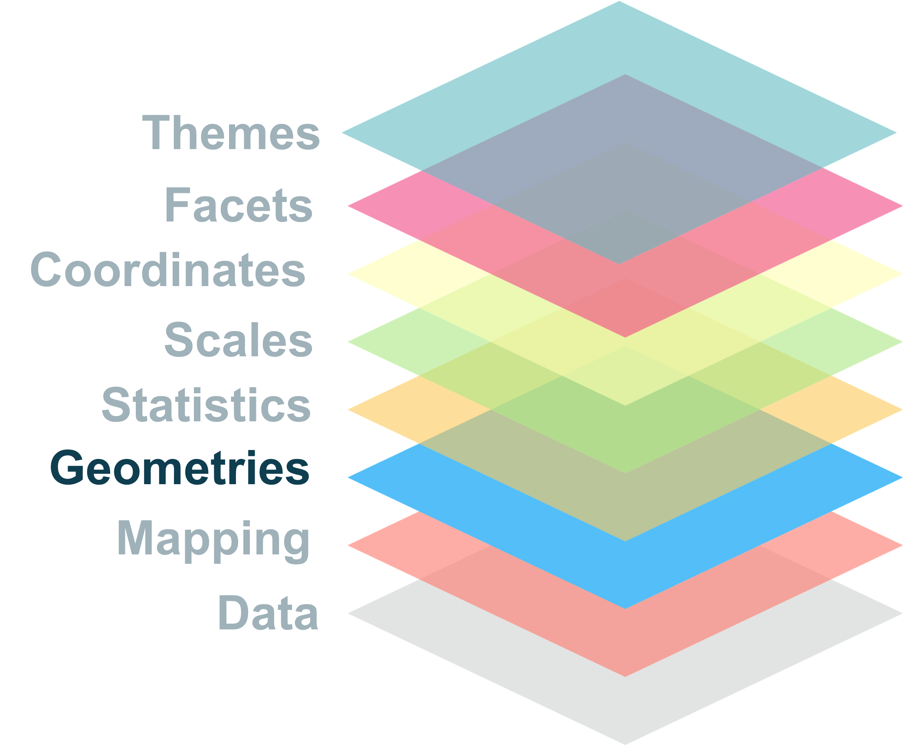
```

```{r fig.height=7, eval=FALSE}
ggplot(data = data1, 
       mapping = aes(x = price, y = carat, color = clarity)) +
  geom_point() #<<
```
]


---

## The idea of grammar of graphics

.leftcol[
```{r fig.height=7, echo=FALSE}
ggplot(data = data1, 
       mapping = aes(x = price, y = carat, color = clarity)) +
  geom_point() +
  stat_smooth()
```
]

.rightcol[
```{r echo=FALSE, out.width="50%", fig.align='center'}
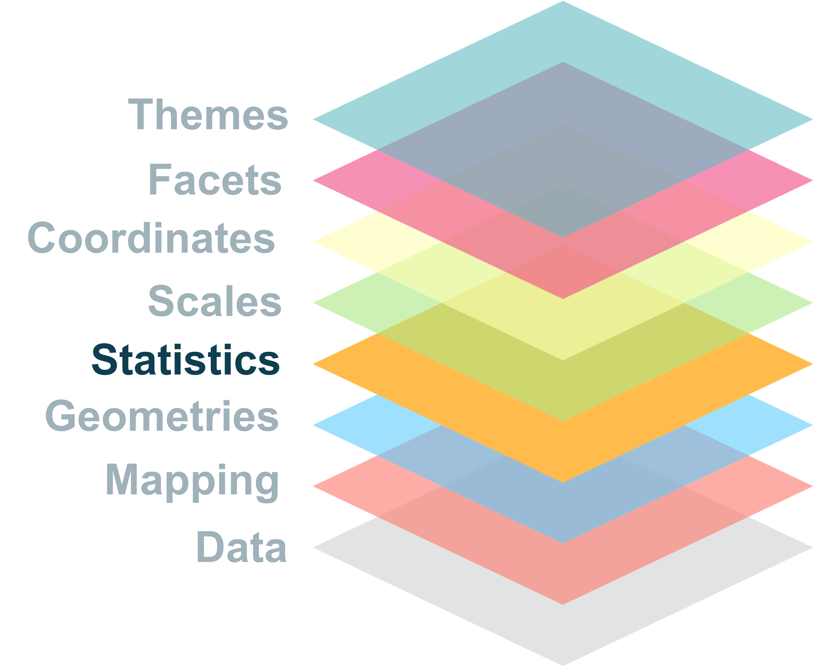
```

```{r fig.height=7, eval=FALSE}
ggplot(data = data1, 
       mapping = aes(x = price, y = carat, color = clarity)) +
  geom_point() +
  stat_smooth() #<<
```
]


---

## The idea of grammar of graphics

.leftcol[
```{r fig.height=7, echo=FALSE}
ggplot(data = data1, 
       mapping = aes(x = price, y = carat, color = clarity)) +
  geom_point() +
  stat_smooth() +
  scale_x_log10()
```
]

.rightcol[
```{r echo=FALSE, out.width="50%", fig.align='center'}
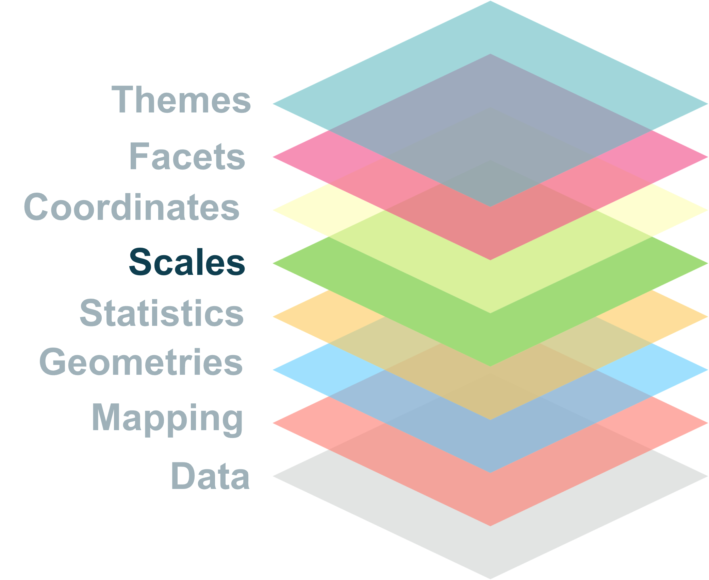
```

```{r fig.height=7, eval=FALSE}
ggplot(data = data1, 
       mapping = aes(x = price, y = carat, color = clarity)) +
  geom_point() +
  stat_smooth() +
  scale_x_log10() #<<
```
]


---

## The idea of grammar of graphics

.leftcol[
```{r fig.height=7, echo=FALSE}
ggplot(data = data1, 
       mapping = aes(x = price, y = carat, color = clarity)) +
  geom_point() +
  stat_smooth() +
  scale_x_log10() +
  coord_flip()
```
]

.rightcol[
```{r echo=FALSE, out.width="50%", fig.align='center'}
knitr::include_graphics("image/gg_coord.png")
```

```{r fig.height=7, eval=FALSE}
ggplot(data = data1, 
       mapping = aes(x = price, y = carat, color = clarity)) +
  geom_point() +
  stat_smooth() +
  scale_x_log10() +
  coord_flip() #<<
```
]


---

## The idea of grammar of graphics

.leftcol[
```{r fig.height=7, echo=FALSE}
ggplot(data = data1, 
       mapping = aes(x = price, y = carat, color = clarity)) +
  geom_point() +
  stat_smooth() +
  scale_x_log10() +
  coord_flip() +
  facet_wrap(~ cut)
```
]


.rightcol[
```{r echo=FALSE, out.width="50%", fig.align='center'}
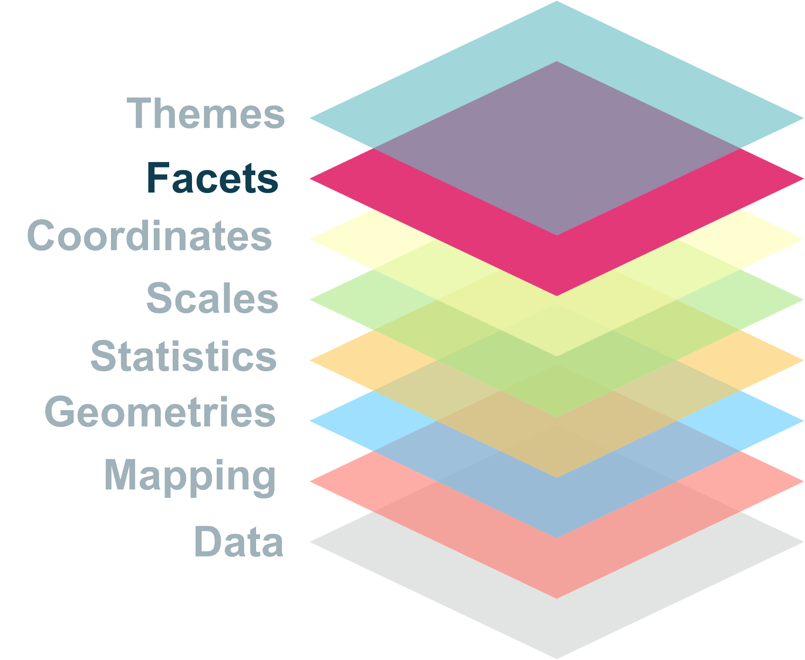
```

```{r fig.height=7, eval=FALSE}
ggplot(data = data1, 
       mapping = aes(x = price, y = carat, color = clarity)) +
  geom_point() +
  stat_smooth() +
  scale_x_log10() +
  coord_flip() +
  facet_wrap(~ cut) #<<
```
]


---

## The idea of grammar of graphics

.leftcol[
```{r fig.height=7, echo=FALSE}
ggplot(data = data1, 
       mapping = aes(x = price, y = carat, color = clarity)) +
  geom_point() +
  stat_smooth() +
  scale_x_log10() +
  coord_flip() +
  facet_wrap(~ cut) +
  theme_light()
```
]

.rightcol[
```{r echo=FALSE, out.width="50%", fig.align='center'}
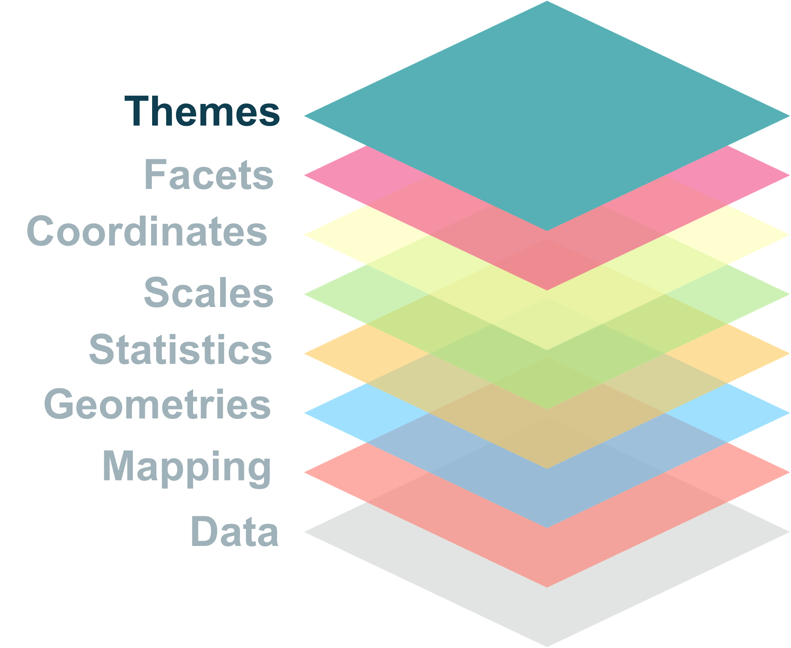
```

```{r fig.height=7, eval=FALSE}
ggplot(data = data1, 
       mapping = aes(x = price, y = carat, color = clarity)) +
  geom_point() +
  stat_smooth() +
  scale_x_log10() +
  coord_flip() +
  facet_wrap(~ cut) +
  theme_light() #<<
```
]


---

class: middle center

# Data and mapping
----

---

## Data

.leftcol60[
+ syntax
```{r eval=FALSE}
ggplot(data = <dataset>)
```

+ For ggplot graphs, data are usually wrangled.

+ Tidy data

  + Each variable is a column
  
  + Each observation is a row
  
  + Each value is a cell
]

.rightcol40[
```{r out.width="70%", fig.align='center', echo=FALSE}

```
]


---

## Mappings

.leftcol60[
+ syntax
```{r eval=FALSE}
ggplot(data = <dataset>,
       mapping = aes(x = <var1>, y = <var2>, ...)) #<<
```

+ Variables are mapped to graphic's visual properties with **aesthetics mapping**

+ Usually we map:

  + one variable on x axis
  
  + one variable on y axis
  
  + mapped to color, shape, fill, group, etc.
]

.rightcol40[
```{r out.width="70%", fig.align='center', echo=FALSE}

```
]

---

## Data and mappings

.leftcol60[

+ Can specify data and mappings in the plot category

```{r eval=FALSE}
ggplot(data = mydata, mapping = aes(x = varX, y = varY))
```

+ Or specify for each layer

```{r eval=FALSE}
ggplot() +
  geom_point(data = mydata, mapping = aes(x = varX, y =varY))
```
]

.rightcol40[
```{r out.width="70%", fig.align='center', echo=FALSE}
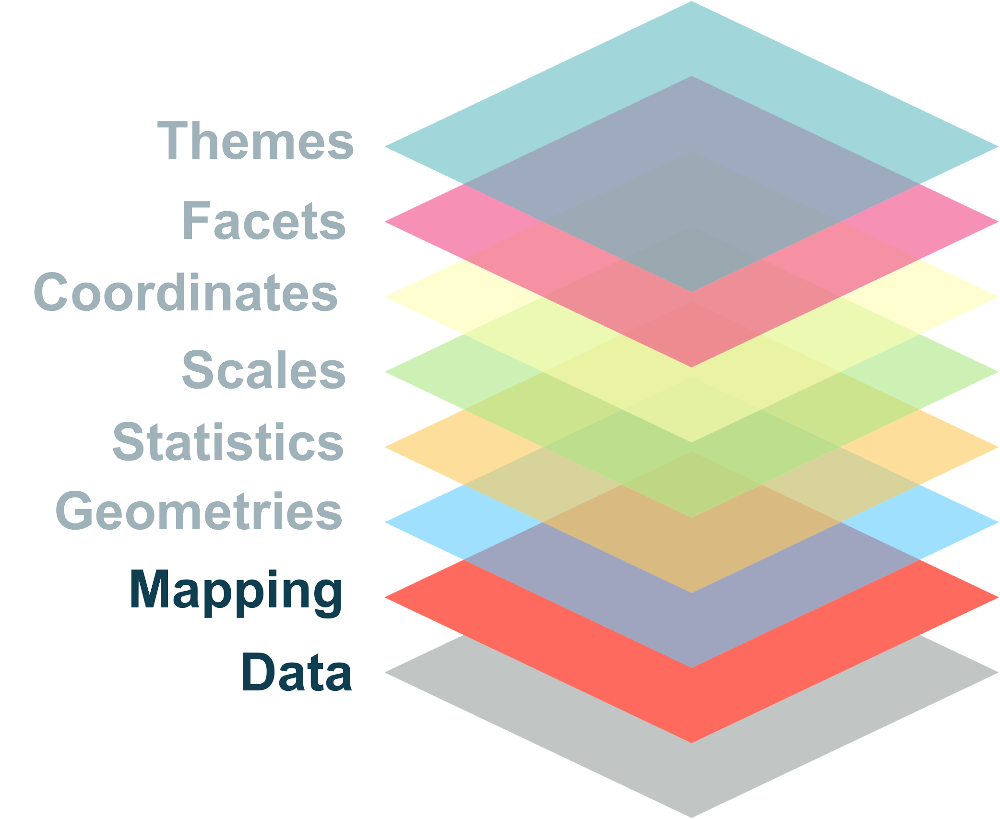
```
]


---

## Data and mapping

.leftcol[
```{r eval=FALSE, fig.height=6}
ggplot(data = mpg, 
       mapping = aes(x = displ, y = hwy, color = class)) + #<<
  geom_point() +
  geom_smooth(se = FALSE)

```

```{r echo=FALSE, fig.height=6}
ggplot(data = mpg, 
       mapping = aes(x = displ, y = hwy, color = class)) + 
  geom_point(size = 4) +
  geom_smooth(se = FALSE, size = 1.5)

```

]

.rightcol[
```{r eval=FALSE, fig.height=6}
ggplot(data = mpg, 
       mapping = aes(x = displ, y = hwy)) +
  geom_point(aes(color = class)) + #<<
  geom_smooth(se = FALSE)

```

```{r echo=FALSE, fig.height=6}
ggplot(data = mpg, 
       mapping = aes(x = displ, y = hwy)) +
  geom_point(aes(color = class), size = 4) +
  geom_smooth(se = FALSE, size = 1.5)

```
]


---

## Aesthetic mapping

.leftcol[

**Setting vs mapping**

Important difference

+ **map** an aesthetic to a **variable**
  
+ **set** an aesthetic to a **constant** value

]

.rightcol[
```{r echo=FALSE, fig.align='center'}
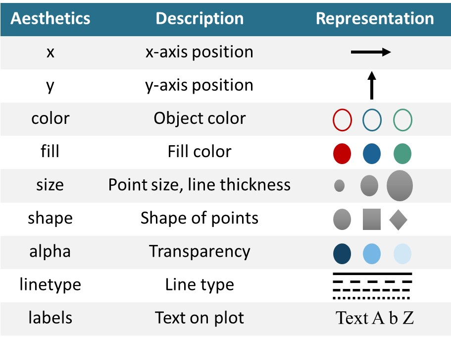
```
]

---

## Aesthetic mapping

.leftcol[
**mapping**
```{r fig.height=5, eval=FALSE}
ggplot(data = mpg, 
       mapping = aes(x = displ, y = hwy, color = class)) + #<<
  geom_point()
```

```{r fig.height=5, echo=FALSE}
ggplot(data = mpg, 
       mapping = aes(x = displ, y = hwy, color = class)) +
  geom_point(size = 4)
```
]

--

.rightcol[
**setting**
```{r fig.height=5, eval=FALSE}
ggplot(data = mpg, 
       mapping = aes(x = displ, y = hwy, color = class)) +
  geom_point(color  = "red") #<<
```

```{r fig.height=5, echo=FALSE}
ggplot(data = mpg, 
       mapping = aes(x = displ, y = hwy, color = class)) +
  geom_point(color = "red", size = 4)
```
]


---

class: middle center

# Geometries
----

---

## Geometries

.leftcol60[
+ syntax
```{r eval=FALSE}
ggplot(data = <dataset>,
       mapping = aes(x = <varX>, y = <varY>, ...)) +
  geom_<function>(...) #<<
```

+ Geometry stands for geom function

+ Tell R how to render each data point on a given figure.

]

.rightcol40[
```{r out.width="70%", fig.align='center', echo=FALSE}

```
]


---

## Geometries

.center[
```{r echo=FALSE, out.width="70%"}
knitr::include_graphics("image/geom_collection.png")
```
.fifty[
Source: [National Bioinformatics Insfrastructure Sweden (NBIS), 2019](https://github.com/NBISweden/RaukR-2019/blob/master/docs/ggplot/presentation/ggplot_presentation_assets/geoms.png) ]
]


---

## Geometries

.leftcol40[
+ Each geom can display certain aesthetics.

+ Some of them are required.

]

.rightcol60[
```{r echo=FALSE, out.width="90%"}
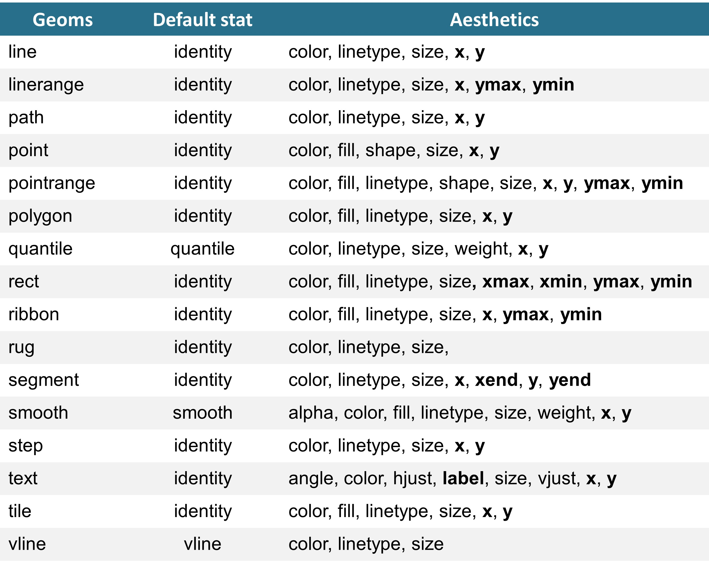
```
]


---

## Geometries

.leftcol40[

**Line plots**

Aesthetics of `geom_path`, `geom_line`, `geom_step`:

+ x
+ y
+ alpha
+ colour/ color
+ linetype
+ size
+ group

We will use the `babynames` data from the `babynames` package for demonstration.

]

.rightcol60[
```{r eval=FALSE}
install.packages("babynames")
library(babynames)
glimpse(babynames)
```

```{r echo=FALSE}
library(babynames)
glimpse(babynames)
```
]


---

## Geometries

.leftcol40[

**Line plots: practice exercise**

+ Recreate the plot shown on the right.

]

.rightcol60[
```{r echo=FALSE, fig.height=6.5, warning=FALSE}
friends <- babynames %>% 
  filter(year >= 1950,
         name %in% c("Christopher", "Dave", "Karl"),
         sex == "M")

ggplot(data = friends,
       mapping = aes(x = year, y = n, color = name)) +
  geom_line(linetype = "dashed") +
  geom_point(size = 2, alpha = 0.5) +
  scale_y_log10() +
  theme_minimal()

```

]


---

## Geometries

.leftcol60[
**Scatterplots**

We can derived plots like:

+ Connected scatter plot (if `geom_line` is added)
+ Bubble plot (mapping size to a variable)

To avoid overlappping
+ alpha aesthetic
+ "jitter" or `geom_jitter` for position

]

.rightcol40[
```{r eval=FALSE}
geom_point(
  mapping = NULL,
  data = NULL,
  stat = "identity",
  position = "identity",
  ...,
  na.rm = FALSE,
  show.legend = NA,
  inherit.aes = TRUE
)
```
]


---

## Geometries

.leftcol60[
**Scatterplots**

#### Colors

+ continuous data
  + `scale_color_gradient`
  + `scale_fill_gradient`
  
+ discrete data
  + `scale_color_manual`
  + `scale_fill_manual`
]

.rightcol40[
```{r eval=FALSE}
geom_point(
  mapping = NULL,
  data = NULL,
  stat = "identity",
  position = "identity",
  ...,
  na.rm = FALSE,
  show.legend = NA,
  inherit.aes = TRUE
)
```
]


---

## Geometries

.leftcol40[

**Scatter plot: practice exercise**

Use the `mpg` data to recreate the plot shown on the right.

]

.rightcol60[
```{r echo=FALSE, fig.height=6.5, warning=FALSE}
mean_hwy_data <- mpg %>% 
  group_by(class) %>% 
  summarise(mean_hwy = mean(hwy, na.rm = TRUE))

ggplot(data = mpg,
       mapping = aes(x = class, y = hwy, color = class)) +
  geom_point(position = "jitter", size = 3, alpha = 0.5) +
  geom_point(data = mean_hwy_data, aes(y = mean_hwy), size = 7) +
  labs(title = "Fuel consumption per class vehicle",
       x = "Class of vehicle",
       y = "Highway fuel consumption") +
  theme_minimal()
  

```
]


---

class: middle center

# Statistical transformation and plotting distribution
----

---

## Statistics

.leftcol60[
+ syntax
```{r eval=FALSE}
ggplot(data = <dataset>,
       mapping = aes(x = <varX>, y = <varY>, ...)) +
  geom_<function>(..., stat = <stat>, position = <position>) + #<<
  geom_<stat>(...) #<<
```

+ Every layer has a statistical transformation associated to it.

+ **geoms** control the way the plot looks

+ **stats** control the way the data is transformed

]

.rightcol40[
```{r out.width="70%", fig.align='center', echo=FALSE}

```
]

---

## Statistics

**Geoms and stats**
.leftcol[
Every geometry has a default stat.
+ `geom_line` default stat is `stat_identity`
+ `geom_point` default stat is `stat_identity`
+ `geom_smooth` default stat is `stat_smooth`

Each stat has a default geom
+ `stat_smooth` default geom is `geom_smooth`
+ `stat_count` default geom is `geom_bar`
+ `stat_sum` default geom is `geom_point`
]

.rightcol40[
```{r out.width="70%", fig.align='center', echo=FALSE}

```
]

---

## Statistics

.leftcol[
**Interesting stats**
+ `stat_smooth(geom_smooth)`
+ `stat_unique(geom_point)`
+ `stat_summary(geom_pointrange`
+ `stat_count(geom_bar)`
+ `stat_bin(geom_histogram)`
+ `stat_density(geom_density)`
+ `stat_boxplot(geom_boxplot)`
+ `stat_ydensity(geom_violin)`
]


.rightcol40[
```{r out.width="70%", fig.align='center', echo=FALSE}

```
]

---
## Statistics

.leftcol[
**Computed aesthetics**

When a stat perform a transformation, new variables are created.

e.g., in `geom_histogram` computed variables are:

  + **`count`** - number of points in bin
  + **`density`**  - density of points in bins, scaled to integrate to 1 ncount.
  + **`ncount`** - count, scaled to maximum of 1
  + **`ndensity`** - density, scaled to maximum of 1
  

To access:
  + old way: **`..<stat name>..`**
  + new way: **`stat(name)`**
  
]

.rightcol[
```{r fig.height=6}
ggplot(data = mpg, mapping = aes(x = displ)) +
  geom_histogram(aes(y = ..count..)) #<<
```
]


---
## Statistics

.leftcol[
**Computed aesthetics**

When a stat perform a transformation, new variables are created.

e.g., in `geom_histogram` computed variables are:

  + **`count`** - number of points in bin
  + **`density`**  - density of points in bins, scaled to integrate to 1 ncount.
  + **`ncount`** - count, scaled to maximum of 1
  + **`ndensity`** - density, scaled to maximum of 1
  

To access:
  + old way: **`..<stat name>..`**
  + new way: **`stat(name)`**
  
]

.rightcol[
```{r fig.height=6}
ggplot(data = mpg, mapping = aes(x = displ)) +
  geom_histogram(aes(y = stat(density))) #<<
```
]

---

## Displaying distribution

.leftcol40[
Ways to look at distributions:

+ Histograms

+ Frequency polygons

+ Density plots

+ Boxplots

+ Violin plots
]

.rightcol60[
```{r echo=FALSE, fig.height=6}
ggplot(data = data1, aes(depth, color = cut, fill = cut)) + 
  geom_density(alpha = 0.5)
```

]


---

## Displaying distribution

.leftcol40[
**Histogram and freq polygon**

**`geom_histogram`**
+ display counts with bars
+ require continuous data

]

.rightcol60[
```{r fig.height=6}
ggplot(data = data1, mapping = aes(x = price)) + 
  geom_histogram() #<<
```

]


---

## Displaying distribution

.leftcol40[
**Histogram and freq polygon**

**`geom_histogram`**
+ display counts with bars
+ require continuous data


**`geom_freqpoly`**
+ use lines instead of bars
+ same parameters can be applied
  + bindwith
  + bins
]

.rightcol60[
```{r fig.height=6}
ggplot(data = data1, mapping = aes(x = price)) + 
  geom_freqpoly() #<<
```

]

---

## Displaying distribution

.leftcol40[
**Histogram and freq polygon**

**`geom_histogram`**
+ display counts with bars
+ require continuous data


**`geom_freqpoly`**
+ use lines instead of bars
+ same parameters can be applied
  + bindwith
  + bins
]

.rightcol60[
```{r fig.height=6}
ggplot(data = data1, mapping = aes(x = price)) + 
  geom_freqpoly() + #<<
  geom_histogram(alpha = 0.4) #<<
```

]


---

## Displaying distribution

.leftcol40[

**`Density plots`**

**`geom_density`**
+ a smoothed version of the frequency polygon
+ different from **`geom_area`** where aesthetic y is needed

]

.rightcol60[
```{r fig.height=6}
ggplot(data = data1, mapping = aes(x = depth)) +
  geom_density() #<<

```

]


---

## Displaying distribution

.leftcol40[

**`Density plots`**

**`geom_density`**
+ a smoothed version of the frequency polygon
+ different from **`geom_area`** where aesthetic y is needed

]

.rightcol60[
```{r fig.height=6}
ggplot(data = data1, mapping = aes(x = depth, color = cut, fill = cut)) +
  geom_density(alpha = 0.4) #<<

```

]

---

## Displaying distribution

.leftcol40[

**`Density plots`**

**`geom_density`**
+ a smoothed version of the frequency polygon
+ different from **`geom_area`** where aesthetic y is needed

**`geom_density_ridges`**
+ available in **ggridges** package
+ create a ridgeline plots

]

.rightcol60[

```{r eval=FALSE, fig.height=6}
install.packages("ggridges")
library(ggridges)
ggplot(data = data1, mapping = aes(x = depth, color = cut, fill = cut)) +
  geom_density_ridges(aes(y = cut)) #<<

```

```{r echo=FALSE, fig.height=5}
library(ggridges)
ggplot(data = data1, mapping = aes(x = depth, color = cut, fill = cut)) +
  geom_density_ridges(aes(y = cut)) #<<

```

]


---

## Displaying distribution

.leftcol40[
**Practice exercise**

Use the `mpg` data to recreate the plot shown on the right.
]

.rightcol60[
```{r echo=FALSE, fig.height=6}
ggplot(data = mpg, 
       mapping = aes(x = displ)) +
  geom_histogram(bins = 10, fill = "cadetblue3", alpha = 0.5) + 
  geom_text(aes(label = stat(count)),
            stat = "bin", 
            bins = 10, 
            nudge_y = 2)
```
]

---

## Displaying distribution

.leftcol40[
**Boxplot**

**`geom_boxplot`**
+ Interesting parameters
  + width and varwidth
  + show.legend
  + outlier.alpha
  + outlier.shape
]

.rightcol60[
```{r fig.height=5.7}
ggplot(data = mpg, mapping = aes(x = class, y = hwy)) +
  geom_boxplot() #<<
  
```
]

---

## Displaying distribution

.leftcol40[
**Violin plot**

**`geom_violin`**
+ Interesting parameters
  + trim
  + scale
  + draw_quantiles
]

.rightcol60[
```{r fig.height=5.7}
ggplot(data = mpg, mapping = aes(x = class, y = hwy)) +
  geom_violin() #<<
  
```
]


---

## Displaying distribution

.leftcol40[
**Practice exercise**

Use the `mpg` data to recreate the plot shown on the right.
]

.rightcol60[
```{r echo=FALSE, fig.height=6}
ggplot(data = mpg, 
       mapping = aes(x = hwy, y = class)) +
  geom_violin(aes(fill = class),
              show.legend = FALSE,
              color = NA,
              alpha = 0.5) +
  geom_boxplot(width = 0.2, 
               fill = NA) +
  scale_fill_viridis_d()
```
]


---

class: middle center

# Scales and position adjustments

----

---

## Scales and position adjustments

.leftcol60[
+ syntax
```{r eval=FALSE}
ggplot(data = <dataset>,
       mapping = aes(x = <varX>, y = <varY>, ...)) +
  geom_<function>(..., stat = <stat>, position = <position>) +0
  geom_<stat>(...) + 
  scale_<aesthetic>_<type> #<<
```

+ **Scales** control how data values are translated to visual properties

+ Can overide default scales like axis,legend, and transformation of data to aesthetics.

]

.rightcol40[
```{r out.width="70%", fig.align='center', echo=FALSE}

```
]


---

## Scales

.leftcol40[

Scales belong to one these types:

+ continuous scale
+ discrete scale
+ binned scale

Naming scheme:

+ *scale + aesthetic + name of scale*

  + `scale_*_continuous()`
  + `scale_*_discrete()`
  + `scale_*_manual()`
]

--

.rightcol60[
```{r echo=FALSE}
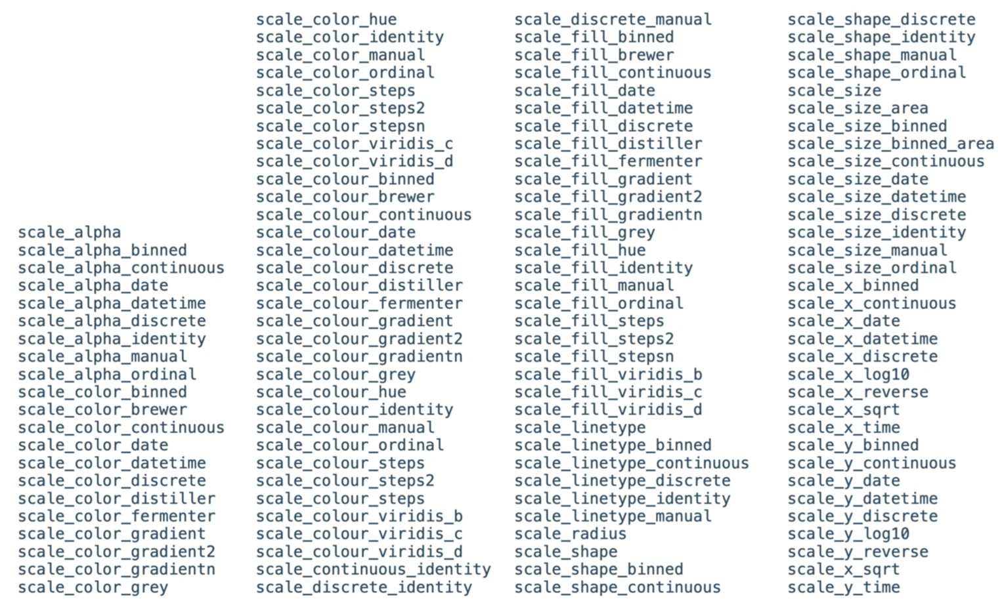
```
]
---

## Scales

.leftcol40[

]

.rightcol60[
```{r echo=FALSE}
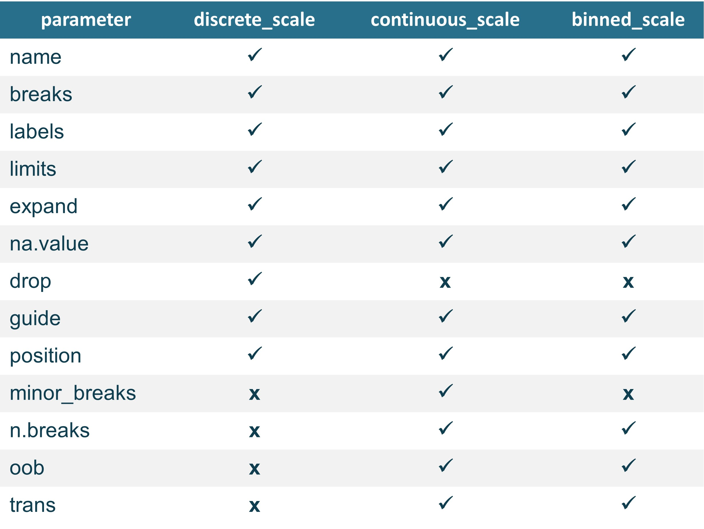
```
]


---

## Scales

.leftcol[

```{r echo=FALSE}
iris_data <- iris %>% tibble() %>% janitor::clean_names()
```

```{r fig.align='center', fig.height=2, fig.width=4}
p <- ggplot(iris_data, aes(x = sepal_length, y = sepal_width, color = species)) + geom_point(size = 2)
p
```
]

--

.rightcol[
```{r fig.align='center', fig.height=2, fig.width=4}
p + scale_color_manual(name = "Manual",
                       values = c("#5BC0EB","#FDE74C","#9BC53D"))
```
]


---

## Scale

.leftcol60[

**Position scales**

#### Continuous
+ scale_x_continuous | scale_y_continuous
+ scale_x_log10 | scale_y_log10
+ scale_x_reverse | scale_y_reverse
+ scale_x_sqrt | scale_x_sqrt

]

.rightcol40[

```
scale_x_continuous(
  name = waiver(),
  breaks = waiver(),
  minor_breaks = waiver(),
  n.breaks = NULL,
  labels = waiver(),
  limits = NULL,
  expand = waiver()
  oob = censor,
  na.value = NA_real_,
  trans = "identity",
  position = "bottom",
  guide = waiver,
  )
```
]

---

## Scale

.leftcol60[

**Position scales**

#### Continuous
+ scale_x_continuous | scale_y_continuous
+ scale_x_log10 | scale_y_log10
+ scale_x_reverse | scale_y_reverse
+ scale_x_sqrt | scale_x_sqrt

#### Binned
+ scale_x_binned | scale_y_binned

]

.rightcol40[
```
scale_x_binned(
  name = waiver(),
  breaks = waiver(),
  labels = waiver(),
  limits = NULL,
  exapand = waiver()
  oob = censor,
  na.value = NA_real_,
  trans = "identity",
  position = "bottom",
  )
```
]

---

## Scale

.leftcol60[

**Position scales**

#### Continuous
+ scale_x_continuous | scale_y_continuous
+ scale_x_log10 | scale_y_log10
+ scale_x_reverse | scale_y_reverse
+ scale_x_sqrt | scale_x_sqrt

#### Binned
+ scale_x_binned | scale_y_binned

#### Discrete
+ scale_x_discrete | scale_y_discrete

]

.rightcol40[
```
scale_x_binned(
  name = waiver(),
  breaks = waiver(),
  labels = waiver(),
  limits = NULL,
  exapand = waiver()
  oob = censor,
  na.value = NA_real_,
  trans = "identity",
  position = "bottom",
  )
```
]

---

## Scale

.leftcol[

**Color scales**

Continuous
+ scale_color_continuous | scale_fill_continuous
+ scale_color_gradient | scale_fill_gradient

Binned
+ scale_color_binned | scale_fill_binned
+ scale_color_steps | scale_fill_steps

Discrete
+ scale_color_discrete | scale_fill_discrete
+ scale_color_hue | scale_fill_hue
+ scale_color_grey | scale_color_grey

]


---

## Scale

.leftcol[

**Viridis family**

Continuous
+ scale_color_viridis_c 
+ scale_fill_viridis_c

Binned
+ scale_color_viridis_b 
+ scale_fill_viridis_b

Discrete
+ scale_color_viridis_d 
+ scale_fill_viridis_d

]

--

.rightcol[
```{r fig.height=4, fig.width=6, fig.align='center'}
ggplot(mtcars, aes(mpg, wt, color = cyl)) +
  geom_point(size = 3) +
  scale_color_viridis_c()
```

]

---

## Scale

.leftcol[

**Colorbrewer family**

Continuous
+ scale_color_distiller | scale_fill_distiller

Binned
+ scale_color_fermenter | scale_fill_fermenter

Discrete
+ scale_color_brewer | scale_fill_brewer


```
#Useful parameters
type = "seq"(sequential, the default), "div"(diverging), "qual"(qualitative)
direction = 1 (default), -1 (reverse order)
palette = name of pallete or index
```


]

--

.rightcol[
```{r echo=FALSE, out.width="80%"}
library(RColorBrewer)

par(mar=c(3,4,2,2))
display.brewer.all(type = "seq" )
display.brewer.all(type = "div" )
display.brewer.all(type = "qual" )
```
]


---

## Scales

**`scale_*_manual`**

.leftcol[

+ available only for discrete scales
+ useful if you want to specify your own set of mappings from levels in the data to aesthetic values.

For example

+ choosing set of colors in discrete color scale
+ specifying your own set of alpha
+ specifying your own set of shapes
+ specifying your own set of linetypes
+ ...

]

--

.rightcol[

```{r fig.height=3.5, fig.width=6, fig.align='center'}
ggplot(mtcars, aes(x = mpg, y = wt, color = factor(cyl))) +
  geom_point(size = 4) +
  scale_color_manual(values = c("blue", "black", "orange")) #<<
```

]

---

## Scales

**`scale_*_manual`**

.leftcol[

+ available only for discrete scales
+ useful if you want to specify your own set of mappings from levels in the data to aesthetic values.

For example

+ choosing set of colors in discrete color scale
+ specifying your own set of alpha
+ specifying your own set of shapes
+ specifying your own set of linetypes
+ ...
]

--

.rightcol[
```{r fig.height=3.5, fig.width=6, fig.align='center'}
ggplot(mtcars, aes(x = mpg, y = wt, alpha = factor(cyl))) +
  geom_point(size = 4) +
  scale_alpha_manual(values = c(0.3, 0.6, 1)) #<<
```
]

---

## Scales

**`scale_*_manual`**

.leftcol[

+ available only for discrete scales
+ useful if you want to specify your own set of mappings from levels in the data to aesthetic values.

For example

+ choosing set of colors in discrete color scale
+ specifying your own set of alpha
+ specifying your own set of shapes
+ specifying your own set of linetypes
+ ...

]

--

.rightcol[

```{r fig.height=3.5, fig.width=6, fig.align='center'}
ggplot(mtcars, aes(x = mpg, y = wt, shape = factor(cyl))) +
  geom_point(size = 4) +
  scale_shape_manual(values = c(5, 10, 8)) #<<
```

]


---

## Scales

.leftcol[
**Shortcuts**

#### Labs

+ modify axis, legend, and plot labels
+ `xlabs`, `ylabs`: modify `x` and `y` axis label names
+ use `labs` with arguments:
  + title
  + x
  + subtitle
  + caption
]

--

.rightcol[
```{r fig.height=3.5, fig.width=6, fig.align='center'}
ggplot(mtcars, aes(mpg, wt)) + geom_point(size = 3) + 
  labs(title = "Title of my plot", #<<
       x = "Miles per gallon", #<<
       y = "Weight", #<<
       subtitle = "This would be a subtitle", #<<
       caption = "This is my caption") #<<
```
]


---

## Scales

.leftcol[
**Shortcuts**

#### Lims

+ modify limits of the plot
+ use `xlim` and `ylim`
```
xlim(0,50)
ylim(NA, 40)
```
+ or `lims` specifying vectors
```
lims(x = c(0, 50))
lims(y = y(NA, 40))
```
]

--

.rightcol[
```{r fig.height=3.2, fig.width=6, fig.align='center'}
ggplot(mtcars, aes(mpg, wt)) + geom_point(size = 3) + 
  labs(title = "Title of my plot",
       x = "Miles per gallon",
       y = "Weight",
       subtitle = "This would be a subtitle",
       caption = "This is my caption") +
  xlim(10, 25) #<<
```
]


---

## Scales

.leftcol[
**Shortcuts**

#### Lims

+ modify limits of the plot
+ use `xlim` and `ylim`
```
xlim(0,50)
ylim(NA, 40)
```
+ or `lims` specifying vectors
```
lims(x = c(0, 50))
lims(y = y(NA, 40))
```
]

--

.rightcol[
```{r fig.height=3, fig.width=6, fig.align='center'}
ggplot(mtcars, aes(mpg, wt)) + geom_point(size = 3) + 
  labs(title = "Title of my plot",
       x = "Miles per gallon",
       y = "Weight", 
       subtitle = "This would be a subtitle",
       caption = "This is my caption") + 
  lims(x = c(0, 20), #<<
       y = c(1, 4)) #<<
```
]


---

## Position adjustments

.leftcol[

+ All layers have a position that resolves overlapping `geoms`

+ Overrides default using `position` argument to `geom_` or `stat_` function.

]


---

## Position adjustments

.leftcol[

**`position_identity`**

+ `?position_identity`

+ Adds random noise to the data points to avoid overlaps

+ Useful for scatterplots

**Ways to call**

```
position = "identity"
position = position_identity()
```
]

--

.rightcol[
```{r fig.height=4, fig.width=6, fig.align='center'}
ggplot(mpg, aes(x = class, y = hwy)) + 
  geom_point(size = 3,
             position = "identity") #<<
```
]


---

## Position adjustments

.leftcol[

**`position_jitter`**

+ `?position_jitter`

+ Adds random noise to the data points to avoid overlaps

+ Useful for scatterplots
  + wrapper: `geom_jitter`

**Parameters**

```
seeds = random seeds to make jitter reproducible
width = amount of jitter horizontally
height = amount of jitter vertically
```
]

--

.rightcol[
```{r fig.height=4, fig.width=6, fig.align='center'}
ggplot(mpg, aes(x = class, y = hwy)) + 
  geom_point(size = 3,
             position = position_jitter(width = 0.2, #<<
                                        seed = 143 )) #<<
```
]


---

## Position adjustments

.leftcol[

**`position_stack()`**

+ `?position_stack`
+ Stacks geoms on top of each other.

**`position_fill()`**

+ `?position_fill`
+ Stacks `geoms` on top of each other and standardizes the height.

**Parameters**

```
reverse - default = FALSE, if TRUE will reverse the default stacking order.
```

]

--

.rightcol[
```{r fig.height=4, fig.width=6, fig.align='center'}
ggplot(mtcars, aes(x = factor(cyl), fill = factor(vs))) + 
  geom_bar(alpha = 0.5,
           position = "identity")

```
]


---

## Position adjustments

.leftcol[

**`position_stack()`**

+ `?position_stack`
+ Stacks geoms on top of each other.

**`position_fill()`**

+ `?position_fill`
+ Stacks `geoms` on top of each other and standardizes the height.

**Parameters**

```
reverse - default = FALSE, if TRUE will reverse the default stacking order.
```

]

--

.rightcol[
```{r fig.height=4, fig.width=6, fig.align='center'}
ggplot(mtcars, aes(x = factor(cyl), fill = factor(vs))) + 
  geom_bar(alpha = 0.5,
           position = "stack") #<<

```
]

---

## Position adjustments

.leftcol[

**`position_stack()`**

+ `?position_stack`
+ Stacks geoms on top of each other.

**`position_fill()`**

+ `?position_fill`
+ Stacks `geoms` on top of each other and standardizes the height.

**Parameters**

```
reverse - default = FALSE, if TRUE will reverse the default stacking order.
```

]

--

.rightcol[
```{r fig.height=4, fig.width=6, fig.align='center'}
ggplot(mtcars, aes(x = factor(cyl), fill = factor(vs))) + 
  geom_bar(alpha = 0.5,
           position = "fill") #<<

```
]

---


## Position adjustment

.leftcol[

**`position_dodge`**

+ `?position_dodge`

+ preserves the vertical position of a geom while adjusting the horizontal position.

]

.rightcol[
```{r fig.height=4, fig.width=6, fig.align='center'}
ggplot(mtcars, aes(x = factor(cyl), fill = factor(vs))) + 
  geom_bar(alpha = 0.5,
           position = "dodge") #<<

```
]


---


## Position adjustment

.leftcol[

**`position_dodge`**

+ `?position_dodge`

+ preserves the vertical position of a geom while adjusting the horizontal position.


**Parameters**

```
width(default = 0.9) refers to dodging width
preserve = "single" / "total" (defaul = "total")
```

]

.rightcol[
```{r fig.height=4, fig.width=6, fig.align='center'}
ggplot(mtcars, aes(x = factor(cyl), fill = factor(vs))) + 
  geom_bar(alpha = 0.5,
           position = position_dodge(width = 1)) #<<

```
]


---


## Position adjustment

.leftcol[

**`position_dodge`**

+ `?position_dodge`

+ preserves the vertical position of a geom while adjusting the horizontal position.


**Parameters**

```
width(default = 0.9) refers to dodging width
preserve = "single" / "total" (defaul = "total")
```

]

.rightcol[
```{r fig.height=4, fig.width=6, fig.align='center'}
ggplot(mtcars, aes(x = factor(cyl), fill = factor(vs))) + 
  geom_bar(alpha = 0.5,
           position = position_dodge(width = 1,
                                     preserve = "single")) #<<

```
]

---

## Scales and position adjustments

.leftcol40[
**Practice exercise**

Use the code below to generate a hypothetical dataset and recreate the barplot on the right.

```{r}
# Create some data
df <- data.frame(supp=rep(c("VC", "OJ"), each=3),
                dose=rep(c("0.5", "1", "2"),2),
                len=c(6.8, 15, 33, 4.2, 10, 29.5))
```

]

.rightcol[
```{r echo=FALSE, fig.height=6, fig.align='center'}
ggplot(df, aes(x = dose, y = len, fill = supp)) + 
  geom_bar(stat = "identity",
           position = "dodge",
           width = 0.5) +
  scale_fill_brewer(palette = "Paired")
```
]


---
## Coordinates

.leftcol[

syntax

```{r eval=FALSE}
ggplot(data = <dataset>,
       mapping = aes(x = <varX>, y = <varY>, ...)) +
  geom_<function>(..., stat = <stat>, position = <position>) +
  geom_<stat>(...) +
  <scale function> +
  <coordinate function>
```

+ Coordinate are sets that locate points in space

+ `coord_cartesian()`

+ `coord_flip()`

+ `coord_polar()`

]

.rightcol[
```{r echo=FALSE, out.width="70%"}
knitr::include_graphics("image/gg_coord.png")
```

]

---

## Coordinates

.leftcol[

**`coord_cartesian()`**

+ default coordinate system

**Zooming into plots**

+ setting limits using scale
  + eliminates data outside the specified range
  
+ setting limits using coordinate system
  + proper way to zoom
  + does not eliminate data outside the plot

**Parameters**

```
xlim, ylim, expand, clip
```

]

.rightcol[
```{r fig.height=4, fig.width=6, fig.align='center'}
p <- ggplot(mtcars, aes(x = mpg, y = hp)) + geom_point(size = 3) + geom_smooth(size = 1.5)
print(p)
```

]

---

## Coordinates

.leftcol[

**`coord_cartesian()`**

+ default coordinate system

**Zooming into plots**

+ setting limits using scale
  + eliminates data outside the specified range
  
+ setting limits using coordinate system
  + proper way to zoom
  + does not eliminate data outside the plot

**Parameters**

```
xlim, ylim, expand, clip
```

]

.rightcol[
```{r fig.height=4, fig.width=6, fig.align='center'}
p + 
  scale_x_continuous(limits = c(15, 20)) #<<
```

]


---

## Coordinates

.leftcol[

**`coord_cartesian()`**

+ default coordinate system

**Zooming into plots**

+ setting limits using scale
  + eliminates data outside the specified range
  
+ setting limits using coordinate system
  + proper way to zoom
  + does not eliminate data outside the plot

**Parameters**

```
xlim, ylim, expand, clip
```

]

.rightcol[
```{r fig.height=4, fig.width=6, fig.align='center'}
p + 
  coord_cartesian(xlim = c(15, 20)) #<<
```

]


---

## Coordinates

.leftcol[

**`coord_cartesian()`**

+ default coordinate system

**Zooming into plots**

+ setting limits using scale
  + eliminates data outside the specified range
  
+ setting limits using coordinate system
  + proper way to zoom
  + does not eliminate data outside the plot

**Parameters**

```
xlim, ylim, expand, clip
```

]

.rightcol[
```{r fig.height=4, fig.width=6, fig.align='center'}
p + 
  coord_cartesian(expand = FALSE) #<<
```

]


---

## Coordinates

.leftcol[

**`coord_cartesian()`**

+ default coordinate system

**Zooming into plots**

+ setting limits using scale
  + eliminates data outside the specified range
  
+ setting limits using coordinate system
  + proper way to zoom
  + does not eliminate data outside the plot

**Parameters**

```
xlim, ylim, expand, clip
```

]

.rightcol[
```{r fig.height=4, fig.width=6, fig.align='center'}
p + 
  coord_cartesian(expand = FALSE,
                  clip = "off") #<<
```

]


---

## Coordinates

.leftcol[

**`coord_flip()`**

+ Flips cartesian coordinates (i.e., horizontal axis becomes vertical axis).

+ Useful to draw plots in horizontal mode without having to change the aesthetic mappings.


]

.rightcol[
```{r fig.height=4, fig.width=6, fig.align='center'}
p + 
  coord_flip() #<<
```

]


---

## Coordinates

.leftcol[

**`coord_polar()`**

+ Apply a pola coordinate system to the plot

**Parameters**

```
theta : map angle to x or y
direction: 1 (clockwise) -1 (anticlockwise)
start: offset of starting point in radian
```


]

.rightcol[
```{r fig.height=4, fig.width=6, fig.align='center'}
ggplot(mpg, aes(x = displ)) + 
  geom_bar()
```

]

---

## Coordinates

.leftcol[

**`coord_polar()`**

+ Apply a pola coordinate system to the plot

**Parameters**

```
theta : map angle to x or y
direction: 1 (clockwise) -1 (anticlockwise)
start: offset of starting point in radian
```


]

.rightcol[
```{r fig.height=4, fig.width=6, fig.align='center'}
ggplot(mpg, aes(x = displ)) + geom_bar() +
  coord_polar() #<<
```

]

---

## Coordinates

.leftcol[

**`coord_polar()`**

+ Apply a pola coordinate system to the plot

**Parameters**

```
theta : map angle to x or y
direction: 1 (clockwise) -1 (anticlockwise)
start: offset of starting point in radian
```


]

.rightcol[
```{r fig.height=4, fig.width=6, fig.align='center'}
ggplot(mpg, aes(x = displ)) + geom_bar() +
  coord_polar(theta = "y") #<<
```

]

---

## Coordinates

.leftcol[

**`coord_polar()`**

+ Apply a pola coordinate system to the plot

**Parameters**

```
theta : map angle to x or y
direction: 1 (clockwise) -1 (anticlockwise)
start: offset of starting point in radian
```


]

.rightcol[
```{r fig.height=4, fig.width=6, fig.align='center'}
ggplot(mpg, aes(x = displ)) + geom_bar() +
  coord_polar(theta = "y",
              direction = -1) #<<
```

]

---

## Coordinates

.leftcol[

**`coord_polar()`**

+ Apply a pola coordinate system to the plot

**Parameters**

```
theta : map angle to x or y
direction: 1 (clockwise) -1 (anticlockwise)
start: offset of starting point in radian
```


]

.rightcol[
```{r fig.height=4, fig.width=6, fig.align='center'}
ggplot(mpg, aes(x = displ)) + geom_bar() +
  coord_polar(theta = "y",
              start = 0.5) #<<
```

]

---

class: middle center

# Facets and Themes
----


---

## Facets

.leftcol[

syntax

```{r eval=FALSE}
ggplot(data = <dataset>,
       mapping = aes(x = <varX>, y = <varY>, ...)) +
  geom_<function>(..., stat = <stat>, position = <position>) +
  geom_<stat>(...) +
  <scale function> +
  <coordinate function> +
  facet_<function>
  
```

+ Facets divide plot into subplots based on the values of one or more discrete variables.

+ `facet_wrap()`

+ `facet_grid()`

]

.rightcol[
```{r echo=FALSE, out.width="70%"}

```

]


---

## Facets

.leftcol[
**`facet_wrap**

+ "wraps" a 1d ribbon of panels into 2d
+ useful if you have a variable with many levels

**Parameters**

```
ncol
nrow
scales

```

]

.rightcol[
```{r echo=FALSE}
theme_set(theme_gray())
```

```{r fig.height=4, fig.width=6, fig.align='center'}
ggplot(mpg, aes(x = displ, hwy)) + 
  geom_blank() + 
  xlab(NULL)
```

]


---

## Facets

.leftcol[
**`facet_wrap**

+ "wraps" a 1d ribbon of panels into 2d
+ useful if you have a variable with many levels

```
ncol
nrow
scales

```

]

.rightcol[
```{r fig.height=4, fig.width=6, fig.align='center'}
ggplot(mpg, aes(x = displ, hwy)) + 
  geom_blank() + 
  xlab(NULL) +
  facet_wrap(~ class) #<<
  
```

]


---

## Facets

.leftcol[
**`facet_grid**

+ produces a 2d grid of panels defined by variables which form the rows and columns

+ `.~ a` spreads the values across columns

+ `b ~ .` spreads the values of `b` down the ro
ws
+ `a ~ b` spreads `a` across columns and `b` down rows


]

.rightcol[
```{r fig.height=4, fig.width=6, fig.align='center'}
ggplot(mpg, aes(x = displ, hwy)) + 
  geom_blank() + 
  xlab(NULL) +
  facet_grid(. ~ cyl) #<<
  
```

]

---

## Facets

.leftcol[
**`facet_grid**

+ produces a 2d grid of panels defined by variables which form the rows and columns
+ `.~ a` spreads the values across columns

+ `b ~ .` spreads the values of `b` down the rows

+ `a ~ b` spreads `a` across columns and `b` down rows


]

.rightcol[
```{r fig.height=4, fig.width=6, fig.align='center'}
ggplot(mpg, aes(x = displ, hwy)) + 
  geom_blank() + 
  xlab(NULL) +
  facet_grid(drv ~ .) #<<
  
```

]

---

## Facets

.leftcol[
**`facet_grid**

+ produces a 2d grid of panels defined by variables which form the rows and columns
+ `.~ a` spreads the values across columns

+ `b ~ .` spreads the values of `b` down the rows

+ `a ~ b` spreads `a` across columns and `b` down rows


]

.rightcol[
```{r fig.height=4, fig.width=6, fig.align='center'}
ggplot(mpg, aes(x = displ, hwy)) + 
  geom_blank() + 
  xlab(NULL) +
  facet_grid(drv ~ cyl) #<<
  
```

]

---

## Themes


.leftcol[

syntax

```{r eval=FALSE}
ggplot(data = <dataset>,
       mapping = aes(x = <varX>, y = <varY>, ...)) +
  geom_<function>(..., stat = <stat>, position = <position>) +
  geom_<stat>(...) +
  <scale function> +
  <coordinate function> +
  facet_<function>
  theme_<function>
  
```

+ Controlling all non-data elements
 + title appearance
 + axis labels
 + axis ticks
 + strips
 + ....


]

.rightcol[
```{r echo=FALSE, out.width="70%"}

```

]

---

## Themes

.leftcol[
**Options**

+ Using the built-in-theme from `ggplot2` library
  + `theme_gray()`
  + `theme_bw()`
  + `theme_light()`
  + `theme_classic(`)
  + `...`
  
+ Using other package e.g., `ggthemes` 

]

.rightcol[
```{r fig.height=4, fig.width=6, fig.align='center'}
ggplot(mpg, aes(x = displ, hwy, color = factor(cyl))) + 
  geom_point(size = 3) +
  theme_gray() #<<
  
```

]


---

## Themes

.leftcol[
**Options**

+ Using the built-in-theme from `ggplot2` library
  + `theme_gray()`
  + `theme_bw()`
  + `theme_light()`
  + `theme_classic(`)
  + `...`
  
+ Using other package e.g., `ggthemes` 

]

.rightcol[
```{r fig.height=4, fig.width=6, fig.align='center'}
ggplot(mpg, aes(x = displ, hwy, color = factor(cyl))) + 
  geom_point(size = 3) +
  theme_bw() #<<
  
```

]

---

## Themes

.leftcol[
**Options**

+ Using the built-in-theme from `ggplot2` library
  + `theme_gray()`
  + `theme_bw()`
  + `theme_light()`
  + `theme_classic(`)
  + `...`
  
+ Using other package e.g., `ggthemes` 

]

.rightcol[
```{r fig.height=4, fig.width=6, fig.align='center'}
ggplot(mpg, aes(x = displ, hwy, color = factor(cyl))) + 
  geom_point(size = 3, show.legend = FALSE) +
  facet_wrap(~ cyl) +
  theme_bw() #<<
  
```

]

---

## Themes

.leftcol[
**Options**

+ Using the built-in-theme from `ggplot2` library
  + `theme_gray()`
  + `theme_bw()`
  + `theme_light()`
  + `theme_classic(`)
  + `...`
  
+ Using other package e.g., `ggthemes` 

]

.rightcol[
```{r fig.height=4, fig.width=6, fig.align='center'}
ggplot(mpg, aes(x = displ, hwy, color = factor(cyl))) + 
  geom_point(size = 3) +
  theme_classic() #<<
  
```

]

---

## Themes

.leftcol[
**Options**

+ Using the built-in-theme from `ggplot2` library
  
+ Using other package e.g., `ggthemes` 
  + `theme_economist_white()`
  + `theme_fivethirtyeight()`
  + `theme_stata()`
  + `theme_tufte()`
  

]

.rightcol[
```{r fig.height=4, fig.width=6, fig.align='center'}
library(ggthemes)
ggplot(mpg, aes(x = displ, hwy, color = factor(cyl))) + 
  geom_point(size = 3) +
  theme_economist_white() #<<
  
```

]

---

## Themes

.leftcol[
**Options**

+ Using the built-in-theme from `ggplot2` library
  
+ Using other package e.g., `ggthemes` 
  + `theme_economist_white()`
  + `theme_fivethirtyeight()`
  + `theme_stata()`
  + `theme_tufte()`
  

]

.rightcol[
```{r fig.height=4, fig.width=6, fig.align='center'}
ggplot(mpg, aes(x = displ, hwy, color = factor(cyl))) + 
  geom_point(size = 3) +
  theme_fivethirtyeight() #<<
  
```

]

---

## Themes

.leftcol[
**Options**

+ Using the built-in-theme from `ggplot2` library
  
+ Using other package e.g., `ggthemes` 
  + `theme_economist_white()`
  + `theme_fivethirtyeight()`
  + `theme_stata()`
  + `theme_tufte()`
  

]

.rightcol[
```{r fig.height=4, fig.width=6, fig.align='center'}
library(ggthemes)
ggplot(mpg, aes(x = displ, hwy, color = factor(cyl))) + 
  geom_point(size = 3) +
  theme_stata() #<<
  
```

]

---

## Themes

.leftcol[
**Options**

+ Using the built-in-theme from `ggplot2` library
  
+ Using other package e.g., `ggthemes` 
  + `theme_economist_white()`
  + `theme_fivethirtyeight()`
  + `theme_stata()`
  + `theme_tufte()`
  

]

.rightcol[
```{r fig.height=4, fig.width=6, fig.align='center'}
library(ggthemes)
ggplot(mpg, aes(x = displ, hwy, color = factor(cyl))) + 
  geom_point(size = 3) +
  theme_tufte() #<<
  
```

]


---

## Practice exercise

.leftcol40[
**Let's apply what we have covered!**

+ Use the mpg dataset to recreate the plot.

+ But first, we need to do some data wrangling!

+ Use the updated mpg data to mimic the plot.


]

.rightcol60[
```{r echo=FALSE}
mpg_2 <- mpg %>% 
  mutate(drive = case_when(drv == "f" ~ "front-wheel drive",
                           drv == "r" ~ "rear-wheel drive",
                           drv == "4" ~ "4-wheel drive"),
         transport = case_when(str_detect(trans, "auto") ~ "automatic trans.",
                               str_detect(trans, "manual") ~ "manual trans."))
```

```{r echo=FALSE, fig.height=4, fig.width=6, fig.align='center'}
ggplot(mpg_2, aes(displ, hwy)) + 
  geom_point(size = 3, alpha = 0.5) +
  geom_smooth(method = "lm") +
  facet_grid(transport ~ drive) +
  theme_bw() +
  theme(plot.title = element_text(hjust = 0.5, face = "bold"),
        strip.text = element_text(face = "bold")) +
  labs(title = "Car fuel consumption",
       x  = "Engine displacement (volume in litres)",
       y = "Highway miles per gallon (mpg)")
```

]


---

class: center

## Session 2... DONE!


```{r echo=FALSE, out.width="60%"}

```


---

class: middle center

# Thank you!

#### Slides created via the R packages:

.leftcol[
 

### xaringan by Yihui
]

.rightcol[
 

### xaringanthemer and xaringanExtra by Garrick
]


